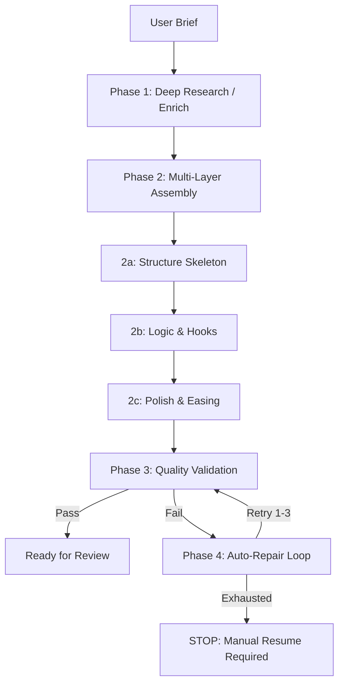

# Velox AI Forge — Pipeline Architecture & Prompts

This document provides a complete technical map of the Forge 2.0 production line, including the exact prompt templates used, the multi-phase generation logic, and the automated repair ecosystem.

---

## 1. High-Level Workflow (The Forge 2.0)

The pipeline is designed as a sequential "Assembly Line" that converts a loose idea into a high-fidelity, validated React component.

---

## 2. Global Code Generation Rules
Every prompt sent to the code generator is prefixed with the `CODE_GEN_SYSTEM_PROMPT`. This ensures the model adheres to the sandbox constraints.

### The System Prompt
The model is strictly governed by the rules in `lib/pipeline/prompts.ts`. Key highlights:
- **Sandbox Safety**: No `import` statements; use `window.React` and `window.Motion`.
- **Viewport Constraints**: No `100vh` or `h-screen`. Use `minHeight: '360px'`.
- **Hook Rules**: All hooks MUST be inside the default export function.
- **Framer Motion v11**: Corrected syntax for `.on('change')` instead of `.onChange()`.

---

## 3. Detailed Phase Breakdown

### Phase 1: Deep Research (Enrich)
**Goal:** Convert a vague prompt into a building-ready JSON specification.
**Input:** User idea name + prompt.
**Core Prompt Snippet:**
> "Enrich the input into a precise, buildable specification... interactions: be concrete — 'whileHover scales card to 1.05x and transitions background from #1a1a1a to #1e293b'..."

### Phase 2: Sequential Assembly (Generate)
To ensure maximum stability and bypass token limits, the pipeline can generate components in three distinct "buffering" phases:

1.  **Phase: Structure**: DOM skeleton and Tailwind styling.
2.  **Phase: Logic & Hooks**: State management and animation values.
3.  **Phase: Polish & Refinement**: Fine-tuning easing, delays, and aesthetics.

---

### Phase 3: Quality Validation
The AI acts as a "Senior Auditor." It receives the **Spec** + **Code** and returns a structured score.

**Key Rule (New in Forge 2.0):**
- **Strict Output**: The validator is forbidden from including code fixes in its report. This prevents hallucinations and preserves token budget.
- **Fail Score**: Any score < 75 triggers an automatic repair.

---

### Phase 4: Automated Repair (Fix)
If validation fails, the Fix phase takes the code + the specific error list.
- **Token Budget**: **40,000 Tokens** (Set project-wide in `vertexPipeline.ts` and `gemini.ts`).
- **Pre-Return Checklist**: The AI runs a final internal audit on hook scope, motion value usage, and spring placement before returning the fixed code.

---

## 4. Resilience & Error Handling

### Project-Wide 40k Budget
We have standardized all generation handlers to a 40k output limit. This eliminates the "truncation mid-file" issue that previously plagued complex component generation.

### Manual Rerun (Human-in-the-Loop)
If the AI cannot resolve issues after **3 attempts**, the production line halts:
1.  The failed stage glows **Red** in the telemtry log.
2.  A **"Resume Stage"** button is injected into the terminal.
3.  The operator can trigger a manual retry for that specific step without losing progress.

---

## 5. File Map for Reference
- **Prompt Source:** [/lib/pipeline/prompts.ts](file:///Users/nitinkhare/Documents/awwwards/velox-%20dashboard/lib/pipeline/prompts.ts)
- **Runner Logic:** [/lib/pipeline/runPipeline.ts](file:///Users/nitinkhare/Documents/awwwards/velox-%20dashboard/lib/pipeline/runPipeline.ts)
- **AI Handlers:** [/lib/ai/vertexPipeline.ts](file:///Users/nitinkhare/Documents/awwwards/velox-%20dashboard/lib/ai/vertexPipeline.ts) | [/lib/ai/gemini.ts](file:///Users/nitinkhare/Documents/awwwards/velox-%20dashboard/lib/ai/gemini.ts)
- **UI Terminal:** [/components/pipeline/LogTerminal.tsx](file:///Users/nitinkhare/Documents/awwwards/velox-%20dashboard/components/pipeline/LogTerminal.tsx)
