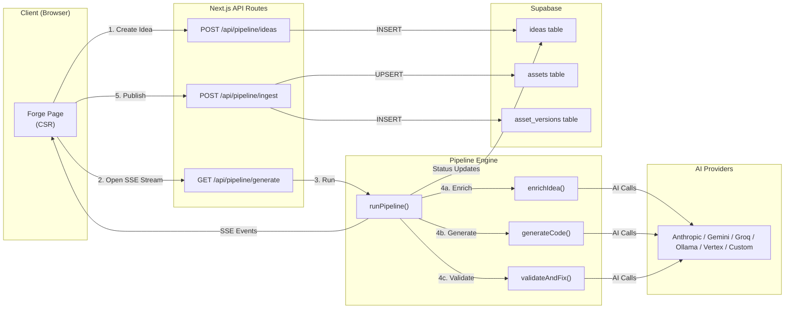
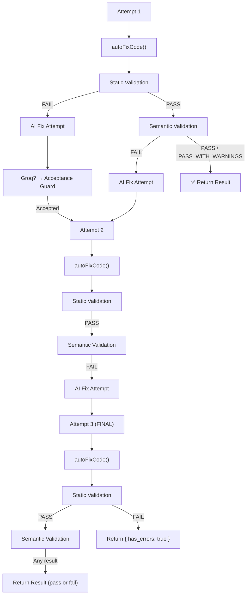
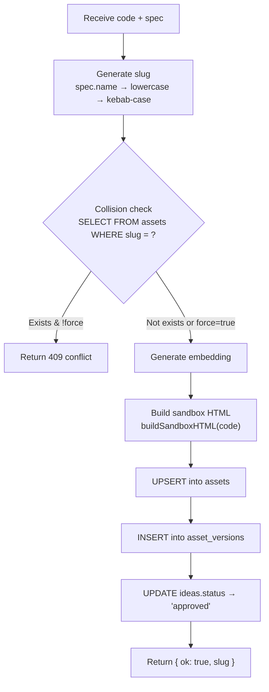
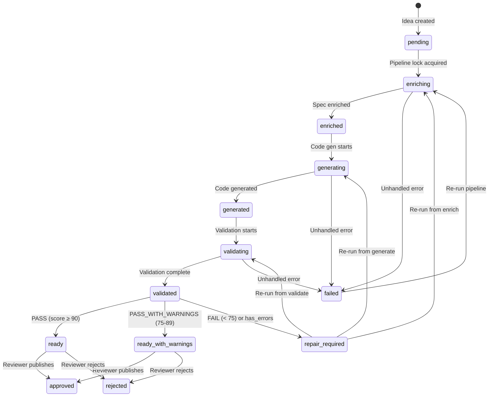

# Velox Pipeline — Full Deep Dive

A complete trace of every stage in the component generation pipeline, from user input to published asset.

---

## Architecture Overview



---

## 🔷 Stage 0 — Idea Creation

> **Who:** Client → `POST /api/pipeline/ideas` → Supabase
> **File:** [route.ts](file:///Users/nitinkhare/Documents/awwwards/velox-%20dashboard/app/api/pipeline/ideas/route.ts) | [page.tsx](file:///Users/nitinkhare/Documents/awwwards/velox-%20dashboard/app/(dashboard)/forge/page.tsx)

### What happens

The user fills out the **Blueprint Studio** form on the Forge page with:
- **name** — e.g. "Magnetic Card"
- **format** — `component | section | template | page`
- **type** — interaction trigger (e.g. "hover")
- **category** — e.g. "animation"
- **tech** — e.g. `["Framer Motion", "Tailwind CSS"]`
- **complexity** — `micro | standard | complex`
- **feel** — `fluid | bouncy | magnetic | minimal | mechanical | elastic | smooth | instant`
- **prompt** — free-text creative description

### Client Payload → API

```json
// POST /api/pipeline/ideas
{
  "name": "Magnetic Card",
  "format": "component",
  "type": "hover",
  "category": "animation",
  "tech": ["Framer Motion", "Tailwind CSS"],
  "complexity": "standard",
  "feel": "magnetic",
  "prompt": "A card that follows the cursor with spring physics and 3D tilt...",
  "pipeline_id": "uuid-of-selected-pipeline"
}
```

### API Processing

```
POST body → extract fields → supabase.from('ideas').insert({
  name, type, category, tech, complexity, feel, prompt
}).select('*')
```

### API Response

```json
{
  "ok": true,
  "ideas": [
    {
      "id": "idea-uuid",
      "name": "Magnetic Card",
      "status": "pending",
      "type": "hover",
      "category": "animation",
      "complexity": "standard",
      "feel": "magnetic",
      "tech": ["Framer Motion", "Tailwind CSS"],
      "prompt": "A card that follows the cursor...",
      "enriched_spec": null,
      "generated_code": null,
      "created_at": "2026-04-18T11:00:00Z"
    }
  ]
}
```

### DB State After

| Column | Value |
|---|---|
| `status` | `pending` |
| `enriched_spec` | `null` |
| `generated_code` | `null` |

---

## 🔷 Stage 1 — Open SSE Stream & Acquire Lock

> **Who:** Client → `GET /api/pipeline/generate?ideaId=xxx` → `runPipeline()`
> **Files:** [generate route](file:///Users/nitinkhare/Documents/awwwards/velox-%20dashboard/app/api/pipeline/generate/route.ts) | [runPipeline.ts](file:///Users/nitinkhare/Documents/awwwards/velox-%20dashboard/lib/pipeline/runPipeline.ts)

### What happens

1. **Pre-flight check:** The route verifies the idea exists and is in a runnable status (`pending | enriched | repair_required | failed`). Returns `409` if already in-flight.

2. **SSE stream opens:** A `ReadableStream` is created with a 15-second heartbeat to keep the connection alive during long AI calls.

3. **Concurrency lock:** `acquirePipelineLock(ideaId)` atomically transitions `status → enriching` using a conditional UPDATE. Only one concurrent request can win this race.

4. **Workflow resolution:** Fetches the selected pipeline (or default) from `pipelines` + `pipeline_stages` tables. Falls back to hardcoded `DEFAULT_PIPELINE_STAGES` if none exist.

5. **Custom provider lookup:** Fetches `ai_providers` table for `base_url` and `env_key` metadata.

### Client Request

```
GET /api/pipeline/generate?ideaId=idea-uuid
Accept: text/event-stream
```

### SSE Response Headers

```
Content-Type: text/event-stream
Cache-Control: no-cache
Connection: keep-alive
```

### Default Pipeline Stages (if no DB config)

```typescript
[
  { step_order: 1, name: 'Research',        action_type: 'enrich_spec',    provider: 'anthropic', model: 'claude-sonnet-4-6' },
  { step_order: 2, name: 'Code Generation', action_type: 'generate_code',  provider: 'anthropic', model: 'claude-sonnet-4-6' },
  { step_order: 3, name: 'Self Correction', action_type: 'validate_code',  provider: 'anthropic', model: 'claude-sonnet-4-6' },
]
```

### DB State After Lock

| Column | Value |
|---|---|
| `status` | `enriching` |

---

## 🔷 Stage 2 — Enrichment (`enrich_spec`)

> **Who:** `runPipeline()` → `enrichIdea()` → `enrichWithProvider()` → AI
> **Files:** [generate.ts](file:///Users/nitinkhare/Documents/awwwards/velox-%20dashboard/lib/pipeline/generate.ts) | [prompts.ts](file:///Users/nitinkhare/Documents/awwwards/velox-%20dashboard/lib/pipeline/prompts.ts) | [anthropic.ts](file:///Users/nitinkhare/Documents/awwwards/velox-%20dashboard/lib/ai/anthropic.ts)

### Purpose

Transform a rough idea (name + prompt + tactical config) into a **precise, buildable `EnrichedSpec`** with animation physics, visual styles, component structure, and implementation notes.

### Payload Construction

```
1. Raw idea fields extracted:
   { name, format, type, category, tech, complexity, feel, prompt }

2. stripEmpty() removes null/undefined/empty values

3. trimIdeaForPrompt() strips empty arrays & null values

4. JSON.stringify() → input string for AI

5. buildEnrichPrompt(input) wraps in a massive system prompt
```

### The Enrich Prompt (condensed)

The prompt sent to the AI includes:
- Role: "senior frontend animation engineer"
- **FORMAT RULES** — behavior based on `format` (component vs section vs template)
- **PHYSICS & FEEL MAPPING** — exact stiffness/damping values for each `feel` type:
  ```
  fluid:      stiffness 100, damping 20
  bouncy:     stiffness 400, damping 10
  magnetic:   stiffness 600, damping 30
  mechanical: stiffness 1000, damping 60
  ```
- **Output schema** — exact JSON structure for `EnrichedSpec`
- The idea JSON as input

### AI Call (Anthropic example)

```typescript
// Uses TOOL USE for structured output
client.messages.create({
  model: 'claude-sonnet-4-6',
  max_tokens: 1200,
  tools: [{
    name: 'output_enriched_spec',
    input_schema: { /* EnrichedSpec JSON Schema */ }
  }],
  tool_choice: { type: 'tool', name: 'output_enriched_spec' },
  messages: [{ role: 'user', content: buildEnrichPrompt(ideaJson) }]
})
```

### AI Response Processing

```
1. Extract tool_use block from response
2. Return JSON.stringify(toolCall.input) → raw string
3. extractJson() cleans markdown fences, repairs truncated JSON
4. JSON.parse() → EnrichedSpec object
```

### Example EnrichedSpec Output

```json
{
  "name": "Magnetic Card",
  "description": "Interactive card with spring-physics cursor tracking and 3D perspective tilt",
  "seo_description": "magnetic spring physics card hover 3D tilt component",
  "animation_spec": {
    "trigger": "hover",
    "entry": "scale from 0.95 with opacity 0",
    "active": "whileHover scale 1.05, 3D rotateX/Y from cursor position",
    "exit": "spring back to rest position",
    "easing": "spring",
    "duration_ms": 300,
    "spring": { "stiffness": 600, "damping": 30, "mass": 1 }
  },
  "visual_spec": {
    "dark_mode": true,
    "color_approach": "Neutral-950 base, gradient accents #6366f1 → #8b5cf6",
    "sizing": "max-w-sm, min-height 360px",
    "border_radius": "24px",
    "shadow": "0 25px 50px -12px rgba(0,0,0,0.5)"
  },
  "component_structure": "Outer motion.div card → inner content wrapper → title + description + CTA button",
  "interactions": ["Cursor tracking with spring physics", "3D tilt on hover", "Scale up on hover"],
  "implementation_notes": "Use useMotionValue for x/y tracking, useSpring with stiffness 600, useTransform for rotateX/Y. Apply springX/springY to outermost motion.div.",
  "tags": ["magnetic", "spring", "3D", "tilt", "card", "hover"],
  "tech": ["Tailwind", "Framer Motion", "React"]
}
```

### SSE Events Emitted

```
data: {"event":"status","stage":"enriching","message":"Executing Stage: Research...","ideaId":"xxx","ideaName":"Magnetic Card"}

data: {"event":"enriched","spec":{...},"ideaId":"xxx","input":"{...}","output":"{...}"}
```

### DB State After

| Column | Value |
|---|---|
| `status` | `enriched` |
| `enriched_spec` | `{ name, description, animation_spec, ... }` |

---

## 🔷 Stage 3 — Code Generation (`generate_code`)

> **Who:** `runPipeline()` → `generateCode()` → `generateWithProvider()` → AI
> **Files:** [generate.ts](file:///Users/nitinkhare/Documents/awwwards/velox-%20dashboard/lib/pipeline/generate.ts) | [prompts.ts](file:///Users/nitinkhare/Documents/awwwards/velox-%20dashboard/lib/pipeline/prompts.ts)

### Purpose

Transform the `EnrichedSpec` into a **sandbox-safe React component** using only globals (`window.Motion`, `window.React`, Tailwind CDN).

### Payload Construction

```
1. trimSpecForCodeGen(spec) keeps ONLY:
   { name, animation_spec, visual_spec, implementation_notes, interactions, tech, component_structure }

2. stripEmpty() removes null/empty values

3. JSON.stringify(trimmed, null, 2) → specJson

4. buildGenPrompt(specJson) wraps in generation prompt
```

### The Generation System Prompt

Sent as the **system message** on every generation call. Key rules:

| Rule | Reason |
|---|---|
| No `import` statements | Sandbox uses UMD globals |
| `const { motion, ... } = window.Motion` | Framer Motion from global |
| No `min-h-screen`, `100vh` | iframe has no viewport |
| `style={{ minHeight: '360px' }}` | Inline sizing only |
| No `window.addEventListener` | Use React event props |
| `.on('change', cb)` not `.onChange()` | FM v11 breaking change |
| Under 200 lines | Sandbox reliability |
| JSDoc header required | Metadata extraction |

### AI Call (Anthropic example)

```typescript
// Uses streaming for long code output
const stream = client.messages.stream({
  model: 'claude-sonnet-4-6',
  max_tokens: 3500,
  system: CODE_GEN_SYSTEM_PROMPT,  // + optional user system_prompt
  messages: [{ role: 'user', content: buildGenPrompt(specJson) }]
})

// Collected via streaming text delta events
let text = ''
for await (const event of stream) {
  if (event.type === 'content_block_delta') {
    text += event.delta.text
  }
}
```

### Post-Processing

```
1. cleanCodeOutput(raw)
   - Strips ```tsx / ``` markdown fences
   - Trims whitespace

2. Return clean code string
```

### SSE Events Emitted

```
data: {"event":"status","stage":"generating","message":"Executing Stage: Code Generation...","ideaId":"xxx"}

data: {"event":"generated","code":"/**\n * @name Magnetic Card\n...","ideaId":"xxx","input":"{...}","output":"..."}
```

### DB State After

| Column | Value |
|---|---|
| `status` | `generated` |
| `generated_code` | `"/** @name Magnetic Card ... export default function MagneticCard() { ... }"` |

---

## 🔷 Stage 4 — Validation & Self-Repair Loop (`validate_code`)

> **Who:** `runPipeline()` → `validateAndFix()` → multiple sub-stages
> **Files:** [generate.ts](file:///Users/nitinkhare/Documents/awwwards/velox-%20dashboard/lib/pipeline/generate.ts) | [validationStatic.ts](file:///Users/nitinkhare/Documents/awwwards/velox-%20dashboard/lib/pipeline/validationStatic.ts) | [validationRuntime.ts](file:///Users/nitinkhare/Documents/awwwards/velox-%20dashboard/lib/pipeline/validationRuntime.ts)

This is the most complex stage. It runs a **loop of up to 3 attempts**, each with multiple sub-steps.

### 4a — Auto-Fix Transform

**Before any validation**, `autoFixCode(code)` applies mechanical transforms:

| Transform | What it does |
|---|---|
| Remove `import` statements | Strip all ES imports |
| `.onChange(` → `.on('change',` | FM v11 compat |
| `React.useState` → `useState` | Strip React prefix |
| `min-h-screen` in className | → `style={{ minHeight: '360px' }}` |
| `h-screen` in className | → `style={{ height: '100%' }}` |
| `'100vh'` / `'100dvh'` | → `'360px'` |
| Missing `window.React` destructuring | Auto-inject for used hooks |
| Missing `window.Motion` destructuring | Auto-inject for used symbols |

### 4b — Static Validation

`validateCodeString(code)` runs **20+ regex-based checks** against the code:

```mermaid
graph TD
  A["validateCodeString(code)"] --> B{"Checks"}
  B --> C["Missing export default function"]
  B --> D["React/FM import statements present"]
  B --> E["Viewport units (100vh, h-screen)"]
  B --> F["Arbitrary Tailwind brackets"]
  B --> G["Template-literal classNames"]
  B --> H["window/document.addEventListener"]
  B --> I["document.querySelector"]
  B --> J[".get() in JSX style props"]
  B --> K["Duplicate style/className props"]
  B --> L["Fake image paths"]
  B --> M["Placeholder icon classes"]
  B --> N["Non-Tailwind className tokens"]
  B --> O["Identical isHovered ternary branches"]
  B --> P[".onChange() calls"]
  B --> Q["Missing window.React destructuring"]
  B --> R["Missing window.Motion destructuring"]
  B --> S["useState passed to useSpring/useTransform"]
  B --> T["Helpers after export default"]
  B --> U["Truncated code (unbalanced braces)"]
  B -->|All pass| V["{ ok: true }"]
  B -->|Any fail| W["{ ok: false, error: 'joined error strings' }"]
```



> [!IMPORTANT]
> If static validation **fails**, the pipeline skips semantic validation entirely and goes straight to a **repair attempt**.

### 4c — Semantic Validation (AI-powered)

If static validation passes, the AI is asked to compare spec vs code:

**Prompt:** `buildValidationPrompt(specJson, code, previousIssues?)`

The AI scores the code 0–100 based on:

| Rule Type | Deduction | Example |
|---|---|---|
| **Critical** (-30 each) | Hooks outside component, unused motion values, missing whileHover | Dead `useMotionValue(1)` for scale when `whileHover` handles it |
| **Major** (-15 each) | Flattened structure, non-Tailwind classNames, wrong scale values | `className="decorative-layer-1"` |
| **Minor** (-5 each) | Missing aria-label, wrong word count on seo_description | No `aria-label` on buttons |

**Scoring:**
- `90–100` → **PASS**
- `75–89` → **PASS_WITH_WARNINGS**
- `< 75` → **FAIL**

**AI Response:**
```json
{
  "status": "PASS_WITH_WARNINGS",
  "score": 82,
  "issues": [
    {
      "severity": "major",
      "type": "spec_violation",
      "message": "whileHover scale is 1.1 but spec defines 1.05"
    },
    {
      "severity": "minor",
      "type": "accessibility",
      "message": "Missing aria-label on interactive card element"
    }
  ],
  "resolution_report": []
}
```

### 4d — Repair Loop (if validation fails)



**Fix Prompt:** `buildFixPrompt(specJson, code, issuesJson, attempt)`

The fix prompt includes:
- **REPAIR RULES:** Priority order (critical → major → minor)
- **HARD RULES:** 10 non-negotiable sandbox constraints
- **PRE-RETURN CHECKLIST:** 5 audits the AI must run before returning code:
  1. Motion value audit (every `useMotionValue` must appear in JSX `style={{}}`)
  2. `isHovered` audit (both ternary branches must differ)
  3. Spring placement audit (`springX/Y` on same element as `onMouseMove`)
  4. className audit (only valid Tailwind tokens)
  5. Resolution audit (confirm each issue is fixed)

**Groq-specific:** After each repair, a separate `checkRepairAcceptanceWithGroq()` call verifies the repair is meaningful (not identical to original). Returns `{ accepted: false }` if the repair changed < 5 lines.

### AI Call Timeouts

| Operation | Default | Gemini | Vertex | Ollama |
|---|---|---|---|---|
| Semantic Validation | 45s | — | 60s | 120s |
| Repair | 90s | 120s | 120s | 180s |

### SSE Events Emitted During Validation

```
data: {"event":"status","stage":"validating","message":"Executing Stage: Self Correction..."}

// On repair attempt:
data: {"event":"status","stage":"validating","message":"Repair attempt 2/3: Fixing issues...","attempt":2}

// Final validation result:
data: {"event":"validated","code":"...","has_errors":false,"validation_report":{"status":"PASS","score":95,"issues":[]}}

// OR fatal failure:
data: {"event":"status","stage":"validating","message":"Pipeline stopped: Maximum repair attempts reached.","isFatal":true}
```

### DB State After

| Column | Value |
|---|---|
| `status` | `validated` |
| `generated_code` | Final (possibly repaired) code |

---

## 🔷 Stage 5 — Terminal Status Resolution

> **Who:** `runPipeline()` → final status write
> **File:** [runPipeline.ts](file:///Users/nitinkhare/Documents/awwwards/velox-%20dashboard/lib/pipeline/runPipeline.ts#L368-L408)

After all stages complete, `inferPipelineStatus()` determines the final status:

```typescript
function inferPipelineStatus(result) {
  if (!result) return 'ready'
  if (result.has_errors === true) return 'repair_required'
  if (result.validation_report?.status === 'FAIL') return 'repair_required'
  if (result.validation_report?.status === 'PASS_WITH_WARNINGS') return 'ready_with_warnings'
  return 'ready'
}
```

### Terminal SSE Events

````carousel
**✅ Success Path** — `ready` or `ready_with_warnings`

```json
{
  "event": "ready",
  "message": "Ready for manual review",
  "status": "ready",
  "ideaId": "idea-uuid",
  "ideaName": "Magnetic Card",
  "code": "/** @name Magnetic Card ... */"
}
```
<!-- slide -->
**❌ Failure Path** — `repair_required`

```json
{
  "event": "repair_required",
  "message": "Validation found blocking issues",
  "status": "repair_required",
  "ideaId": "idea-uuid",
  "ideaName": "Magnetic Card",
  "has_errors": true,
  "issues": [
    { "severity": "critical", "type": "hooks_scope", "message": "useState called at module scope" }
  ]
}
```
<!-- slide -->
**💀 Unhandled Error** — `failed`

If an exception escapes the pipeline, `releasePipelineLock()` sets `status = 'failed'`.

```json
{
  "event": "error",
  "message": "AI Provider (anthropic) returned an empty response...",
  "ideaId": "idea-uuid"
}
```
````

---

## 🔷 Stage 6 — Manual Review

> **Who:** Human reviewer on the Review page
> **File:** [review page](file:///Users/nitinkhare/Documents/awwwards/velox-%20dashboard/app/(dashboard)/pipeline/review/page.tsx) | [ideas API](file:///Users/nitinkhare/Documents/awwwards/velox-%20dashboard/app/api/pipeline/ideas/route.ts)

The Review page queries:
```
GET /api/pipeline/ideas?status=reviewing,validated,generated,ready,ready_with_warnings,repair_required,failed
```

The reviewer sees:
1. **Live preview** — code is compiled into sandbox HTML via `buildSandboxHTML()` and rendered in an iframe
2. **Validation report** — score, issues, resolution tracking
3. **Code editor** — can manually edit the generated code

Actions available:
- **Approve & Publish** → triggers Stage 7
- **Reject** → `PATCH /api/pipeline/ideas { id, status: 'rejected' }`
- **Re-run validation** → SSE stream with `resumeFromAction=validate_code`
- **Re-generate** → SSE stream with `resumeFromAction=generate_code`

---

## 🔷 Stage 7 — Publishing (Ingestion)

> **Who:** Review page → `POST /api/pipeline/ingest` → `ingestAsset()`
> **Files:** [ingest route](file:///Users/nitinkhare/Documents/awwwards/velox-%20dashboard/app/api/pipeline/ingest/route.ts) | [ingest.ts](file:///Users/nitinkhare/Documents/awwwards/velox-%20dashboard/lib/pipeline/ingest.ts) | [sandbox.ts](file:///Users/nitinkhare/Documents/awwwards/velox-%20dashboard/lib/preview/sandbox.ts)

### Client Payload

```json
// POST /api/pipeline/ingest
{
  "code": "/** @name Magnetic Card ... */\nexport default function MagneticCard() { ... }",
  "spec": { "name": "Magnetic Card", "description": "...", "animation_spec": {...}, ... },
  "ideaId": "idea-uuid",
  "isPro": false,
  "force": false
}
```

### Processing Steps



### 7a — Slug Generation

```typescript
const slug = spec.name
  .toLowerCase()
  .replace(/\s+/g, '-')
  .replace(/[^a-z0-9-]/g, '')
// "Magnetic Card" → "magnetic-card"
```

> [!WARNING]
> Slug-based upsert means publishing "Magnetic Card" twice silently **overwrites** the existing asset.

### 7b — Embedding Generation (Optional)

```typescript
const embeddingInput = [
  spec.name,
  spec.description || '',
  spec.seo_description || spec.description || '',
  ...(spec.tags ?? []),
  ...(spec.animation_spec?.trigger ? [spec.animation_spec.trigger] : [])
].join(' ')

// OpenAI text-embedding-3-small
const embRes = await openai.embeddings.create({
  model: 'text-embedding-3-small',
  input: embeddingInput
})
```

If `OPENAI_API_KEY` is missing, embeddings are silently skipped.

### 7c — Sandbox HTML Construction

`buildSandboxHTML(code)` creates a self-contained HTML document:

| Component | Source |
|---|---|
| React 18 | `unpkg.com/react@18/umd/react.development.js` |
| ReactDOM 18 | `unpkg.com/react-dom@18/umd/react-dom.development.js` |
| Framer Motion 11 | `unpkg.com/framer-motion@11/dist/framer-motion.js` |
| GSAP 3 | `unpkg.com/gsap@3/dist/gsap.min.js` |
| Babel Standalone | `unpkg.com/@babel/standalone/babel.min.js` |
| Tailwind CDN | `cdn.tailwindcss.com` |

The sandbox:
1. Sets `window.Motion = FramerMotion` and `window.GSAP = gsap`
2. Polyfills `.onChange()` back onto MotionValue prototype
3. Destructures all React hooks and Motion symbols as globals
4. Strips `export default function X` → `function X`
5. Wraps in `<script type="text/babel">` for JSX transpilation
6. Renders inside an `__ErrorBoundary__` class component
7. Includes error overlay for runtime crashes

### 7d — Asset Upsert

```typescript
supabase.from('assets').upsert({
  slug: 'magnetic-card',
  name: 'Magnetic Card',
  category: 'animation',
  type: 'hover',           // from animation_spec.trigger
  code: '/** @name ... */',
  preview_html: '<html>...</html>',
  description: '...',
  seo_description: '...',
  tags: ['magnetic', 'spring', '3D'],
  tech: ['Tailwind', 'Framer Motion'],
  complexity: 'medium',
  animation_spec: { ... },
  visual_spec: { ... },
  is_pro: false,
  is_published: true,
  license: 'owned',
  embedding: [0.123, -0.456, ...]  // if available
}, { onConflict: 'slug' })
```

### DB State After

**`ideas` table:**
| Column | Value |
|---|---|
| `status` | `approved` |

**`assets` table:** New row with `is_published = true`

**`asset_versions` table:** New row with `{ asset_slug, code }`

---

## Complete Status Machine



---

## Provider Dispatch Matrix

Which AI function is called for each stage and provider:

| Provider | Enrich | Generate | Validate | Fix |
|---|---|---|---|---|
| **Anthropic** | `enrichWithClaude()` | `generateWithClaude()` | `validateWithClaude()` | `fixWithClaude()` |
| **Gemini** | `enrichWithGemini()` | `generateWithGemini()` | `validateWithGemini()` | `fixWithGemini()` |
| **Groq** | `enrichWithGroq()` | `generateWithGroq()` | `validateWithGroq()` | `fixWithGroq()` |
| **Vertex** | `enrichWithVertex()` | `generateWithVertex()` | `validateWithVertex()` | `fixWithVertex()` |
| **Ollama** | `enrichWithOllama()` | `generateWithOllama()` | `validateWithOllama()` | `fixWithOllama()` |
| **Custom** | `enrichWithCustom()` | `generateWithCustom()` | — (falls to Ollama) | — |

> [!NOTE]
> All providers use the **same prompts** (`buildEnrichPrompt`, `buildGenPrompt`, `buildValidationPrompt`, `buildFixPrompt`). The dispatch layer only handles the API client differences.

---

## SSE Event Summary (Complete)

| Event | When | Key Payload | Client Action |
|---|---|---|---|
| `status` | Stage begins or repair attempt | `stage`, `message`, `attempt?`, `isFatal?` | Update progress bar |
| `enriched` | Enrichment complete | `spec`, `input`, `output` | Log success |
| `generated` | Code generation complete | `code`, `input`, `output` | Log success |
| `validated` | Validation pass complete | `code`, `has_errors`, `validation_report` | Log result |
| `ready` | Pipeline succeeded | `status`, `code`, `ideaId` | Show completion UI |
| `repair_required` | Pipeline failed validation | `status`, `issues[]`, `ideaId` | Show failure UI |
| `error` | Unhandled exception | `message` | Show toast error |

---

## Full Source Code — All Pipeline Files

---

### `types/pipeline.ts` — Type Definitions

```typescript
import type { AnimationSpec, VisualSpec } from './asset'

export interface PipelineConfig {
  id: string
  name: string
  model: string
  provider: 'anthropic' | 'gemini' | 'groq' | 'ollama' | string
  base_url?: string | null
  system_prompt: string | null
  is_default: boolean
}

export type PipelineStageAction = 'enrich_spec' | 'generate_code' | 'validate_code'

export interface PipelineStageConfig {
  id?: string
  pipeline_id?: string
  step_order?: number
  name: string
  action_type: PipelineStageAction
  provider: PipelineConfig['provider']
  model: string
  system_prompt?: string | null
}

export interface WorkflowPipeline extends PipelineConfig {
  description?: string | null
  pipeline_stages?: PipelineStageConfig[]
}

export type IdeaStatus =
  | 'pending' | 'enriching' | 'enriched' | 'generating' | 'generated'
  | 'validating' | 'validated' | 'reviewing' | 'ready' | 'repair_required' | 'ready_with_warnings' | 'approved' | 'rejected' | 'failed'

export interface Idea {
  id: string
  name: string
  type: string
  category: string
  format: 'component' | 'section' | 'template' | 'page'
  tech: string[]
  complexity: 'low' | 'medium' | 'high' | 'micro' | 'standard' | 'complex'
  feel: 'fluid' | 'bouncy' | 'magnetic' | 'minimal' | 'mechanical' | 'elastic' | 'smooth' | 'instant'
  prompt?: string
  enriched_spec?: EnrichedSpec
  generated_code?: string | null
  status: IdeaStatus
  error_log?: string
  created_at?: string
  updated_at?: string
}

export interface EnrichedSpec {
  name: string
  description: string
  seo_description: string
  animation_spec: AnimationSpec
  visual_spec: VisualSpec
  implementation_notes: string
  tags: string[]
  component_structure: string
  interactions: string[]
  tech: string[]
}

export interface ValidationIssue {
  severity: 'critical' | 'major' | 'minor'
  type: string
  message: string
}

export interface ResolutionEntry {
  previous_message: string
  resolved: boolean
  resolution_note: string
}

export interface ValidationReport {
  status: 'PASS' | 'PASS_WITH_WARNINGS' | 'FAIL'
  score: number
  issues: ValidationIssue[]
  resolution_report?: ResolutionEntry[]
}

export interface GeneratedCode {
  code: string
  imports: string[]
  has_errors: boolean
  validation_notes?: string
  validation_report?: ValidationReport
}

export interface StructuredIdeaInput {
  name: string
  type: string
  category: string
  format?: 'component' | 'section' | 'template' | 'page'
  tech: string[]
  complexity: 'low' | 'medium' | 'high' | 'micro' | 'standard' | 'complex'
  feel: 'fluid' | 'bouncy' | 'magnetic' | 'minimal' | 'mechanical' | 'elastic' | 'smooth' | 'instant'
}

export type PipelineEvent =
  | {
      event: 'status'
      stage: string
      message: string
      ideaId?: string
      ideaName?: string
      runId?: string
      input?: string
      output?: string
      attempt?: number
      isFatal?: boolean
    }
  | {
      event: 'enriched'
      spec: EnrichedSpec
      ideaId?: string
      ideaName?: string
      runId?: string
      input?: string
      output?: string
    }
  | {
      event: 'generated'
      code: string
      ideaId?: string
      ideaName?: string
      runId?: string
      input?: string
      output?: string
    }
  | {
      event: 'validated'
      code: string
      has_errors: boolean
      validation_notes?: string
      validation_report?: ValidationReport
      ideaId?: string
      ideaName?: string
      runId?: string
      input?: string
      output?: string
      isFatal?: boolean
    }
  | {
      event: 'ready'
      message: string
      status: Extract<IdeaStatus, 'ready' | 'ready_with_warnings' | 'reviewing'>
      ideaId: string
      code: string
      ideaName?: string
      runId?: string
    }
  | {
      event: 'repair_required'
      message: string
      status: 'repair_required'
      ideaId: string
      has_errors?: boolean
      issues?: ValidationIssue[]
      ideaName?: string
      runId?: string
    }
  | {
      event: 'error'
      message: string
      ideaId?: string
      ideaName?: string
      runId?: string
      isFatal?: boolean
      action?: PipelineStageAction
    }
  | {
      event: 'run_started'
      runId: string
      totalIdeas: number
      pipelineId?: string | null
    }
  | {
      event: 'ideas_created'
      runId: string
      ideaIds: string[]
    }
  | {
      event: 'idea_started'
      runId: string
      ideaId: string
      ideaName: string
      index: number
      total: number
    }
  | {
      event: 'idea_completed'
      runId: string
      ideaId: string
      ideaName: string
      status: IdeaStatus
      index: number
      total: number
    }
  | {
      event: 'run_completed'
      runId: string
      ideaIds: string[]
      status: 'completed'
      completed: number
      failed: number
    }

export type LogLevel = 'info' | 'success' | 'warning' | 'error' | 'system'

export type LogStage =
  | 'SYSTEM'
  | 'ENRICH'
  | 'GEN'
  | 'VALID'
  | 'FIX'
  | 'REPAIR'
  | 'INGEST'
  | 'DONE'
  | 'ERROR'

export interface LogEntry {
  id: string
  ts: string
  stage: LogStage
  level: LogLevel
  ideaName?: string
  message: string
  detail?: string
  input?: string
  output?: string
  attempt?: number
  action?: PipelineStageAction
  isFatal?: boolean
}

export interface IdeaRunState {
  ideaId: string
  ideaName: string
  status: 'queued' | 'running' | 'done' | 'failed'
  progress: number
  startedAt?: number
  durationMs?: number
  attempt?: number
  action?: PipelineStageAction
  isFatal?: boolean
}

export interface RunSession {
  id: string
  startedAt: number
  ideas: IdeaRunState[]
  logs: LogEntry[]
  isRunning: boolean
  totalDone: number
  totalFailed: number
}

export type VisualizationStageKey = 'enrich' | 'generate' | 'validate' | 'repair'
export type VisualizationStageState = 'not_started' | 'running' | 'completed' | 'failed'
export type VisualizationContentFormat = 'text' | 'json' | 'code'

export interface VisualizationContentBlock {
  format: VisualizationContentFormat
  title: string
  content: string
}

export interface VisualizationIdeaSnapshot {
  id: string
  name: string
  type: string
  category: string
  tech: string[]
  complexity: string
  feel: string
  status: IdeaStatus
  enriched_spec?: EnrichedSpec
  generated_code?: string | null
  error_log?: string
}

export interface VisualizationStageTrace {
  stage: VisualizationStageKey
  state: VisualizationStageState
  input: VisualizationContentBlock
  output: VisualizationContentBlock
  idea: VisualizationIdeaSnapshot
  error?: string
  updatedAt?: string
}

export interface RunVisualizationStageResponse {
  ok: boolean
  stage: VisualizationStageKey
  state: VisualizationStageState
  input: VisualizationContentBlock
  output: VisualizationContentBlock
  idea: VisualizationIdeaSnapshot
  error?: string
}
```

---

### `types/asset.ts` — Asset Type Definitions

```typescript
export interface Asset {
  id: string
  slug: string
  name: string
  category: 'animation' | 'component' | 'template'
  type: string
  code: string
  preview_html?: string
  description: string
  seo_description?: string
  tags: string[]
  tech: string[]
  complexity: 'low' | 'medium' | 'high'
  animation_spec?: AnimationSpec
  visual_spec?: VisualSpec
  is_pro: boolean
  is_published: boolean
  license: string
  created_at: string
  upvotes?: number
}

export interface AnimationSpec {
  trigger: 'hover' | 'click' | 'scroll' | 'mount' | 'continuous'
  entry: string
  active: string
  exit: string
  easing: string
  duration_ms: number
  spring?: { stiffness: number; damping: number }
}

export interface VisualSpec {
  dark_mode: boolean
  color_approach: string
  typography?: string
  sizing?: string
}
```

---

### `lib/db/supabase.ts` — Supabase Client

```typescript
import { createClient } from '@supabase/supabase-js'

export const supabase = createClient(
  process.env.NEXT_PUBLIC_SUPABASE_URL!,
  process.env.SUPABASE_SERVICE_ROLE_KEY ?? process.env.SUPABASE_SERVICE_KEY ?? process.env.NEXT_PUBLIC_SUPABASE_ANON_KEY!
)
```

---

### `lib/db/schema-utils.ts` — Schema Utilities

```typescript
export function isMissingColumnError(message?: string): boolean {
  if (!message) return false
  const isPgError = /column\s+ideas\..+\s+does not exist/i.test(message)
  const isSchemaCacheError = /Could not find the '.+' column of 'ideas' in the schema cache/i.test(message)
  return isPgError || isSchemaCacheError
}

export function getMissingColumnName(message?: string): string | null {
  if (!message) return null
  const pgMatch = /column\s+ideas\.(.+)\s+does not exist/i.exec(message)
  if (pgMatch?.[1]) return pgMatch[1]
  const cacheMatch = /Could not find the '(.+)' column of 'ideas'/i.exec(message)
  if (cacheMatch?.[1]) return cacheMatch[1]
  return null
}

export function isMissingPromptColumnError(message?: string): boolean {
  return isMissingColumnError(message)
}
```

---

### `app/api/pipeline/ideas/route.ts` — Ideas CRUD API

```typescript
import { NextRequest, NextResponse } from 'next/server'
import { supabase } from '@/lib/db/supabase'
import { Idea, IdeaStatus } from '@/types/pipeline'

const IDEA_SELECT_WITH_PROMPT =
  'id, name, type, category, complexity, status, enriched_spec, feel, prompt, tech, generated_code, created_at'
const IDEA_SELECT_WITHOUT_PROMPT =
  'id, name, type, category, complexity, status, enriched_spec, feel, tech, generated_code, created_at'

const PATCHABLE_FIELDS = new Set([
  'name', 'type', 'category', 'tech',
  'complexity', 'feel', 'prompt', 'status',
  'enriched_spec', 'generated_code',
])

const VALID_STATUSES: IdeaStatus[] = [
  'pending', 'enriching', 'enriched', 'generating', 'generated',
  'validating', 'validated', 'ready', 'reviewing', 'repair_required',
  'ready_with_warnings', 'approved', 'rejected', 'failed',
]

import { isMissingColumnError } from '@/lib/db/schema-utils'

function withPromptField<T>(rows: T[]): Array<T & { prompt: string | null }> {
  return rows.map((row: any) => ({
    ...row,
    prompt: typeof row.prompt === 'string' ? row.prompt : null,
  }))
}

function buildIdeasQuery(selectClause: string, status: string | null, ids: string | null) {
  let query = supabase
    .from('ideas')
    .select(selectClause)
    .order('created_at', { ascending: false })

  if (ids) {
    query = query.in('id', ids.split(','))
  } else if (status) {
    query = query.in('status', status.split(','))
  }

  return query.limit(100)
}

export async function GET(req: NextRequest) {
  const status = req.nextUrl.searchParams.get('status')
  const ids = req.nextUrl.searchParams.get('ids')
  const requestedStatuses = status?.split(',').map(value => value.trim()).filter(Boolean) ?? []
  const reviewFacingStatuses = new Set(['reviewing', 'ready', 'ready_with_warnings', 'validated', 'generated'])

  let { data, error } = await buildIdeasQuery(IDEA_SELECT_WITH_PROMPT, status, ids)

  if (error && isMissingColumnError(error.message)) {
    const fallback = await buildIdeasQuery(IDEA_SELECT_WITHOUT_PROMPT, status, ids)
    data = fallback.data
    error = fallback.error
  }

  if (error) {
    return NextResponse.json({ error: error.message }, { status: 500 })
  }

  const ideas = withPromptField((data ?? []) as any as Idea[])

  if (requestedStatuses.some(value => reviewFacingStatuses.has(value))) {
    const invalidIdeas = ideas.filter((idea) => {
      if (!reviewFacingStatuses.has(idea.status)) return false
      return typeof idea.generated_code !== 'string' || idea.generated_code.trim().length === 0
    })

    if (invalidIdeas.length > 0) {
      await Promise.all(
        invalidIdeas.map((idea) =>
          supabase
            .from('ideas')
            .update({
              status: 'repair_required',
              error_log: 'Missing generated_code while in a review-facing status.',
            })
            .eq('id', idea.id),
        ),
      )
    }

    return NextResponse.json({
      ideas: ideas.filter((idea) => !invalidIdeas.some((invalidIdea) => invalidIdea.id === idea.id)),
    })
  }

  return NextResponse.json({ ideas })
}

export async function POST(req: NextRequest) {
  const body = await req.json()
  const items = Array.isArray(body) ? body : [body]

  const rows = items.map((p: Record<string, unknown>) => ({
    name: p.name as string,
    type: (p.type as string) || 'hover',
    category: (p.category as string) || 'animation',
    tech: (p.tech as string[]) || [],
    complexity: (p.complexity as string) || 'medium',
    feel: (p.feel as string) || '',
    prompt: (p.prompt as string) || null,
  }))

  let { data, error } = await supabase.from('ideas').insert(rows).select('*')

  if (error && isMissingColumnError(error.message)) {
    const fallbackRows = rows.map((row) => {
      const { prompt, ...nextRow } = row
      return nextRow
    })
    const fallback = await supabase.from('ideas').insert(fallbackRows).select('*')
    data = fallback.data
    error = fallback.error
  }

  if (error) {
    return NextResponse.json({ error: error.message }, { status: 500 })
  }

  return NextResponse.json({ ok: true, ideas: withPromptField((data ?? []) as Record<string, unknown>[]) })
}

export async function PATCH(req: NextRequest) {
  let body: Record<string, unknown>
  try {
    body = await req.json()
  } catch {
    return NextResponse.json({ ok: false, error: 'Invalid JSON' }, { status: 400 })
  }

  const { id, ...rawUpdates } = body

  if (!id || typeof id !== 'string') {
    return NextResponse.json({ ok: false, error: 'id is required' }, { status: 400 })
  }

  const updates: Record<string, unknown> = {}
  const rejected: string[] = []

  for (const [key, value] of Object.entries(rawUpdates)) {
    if (PATCHABLE_FIELDS.has(key)) updates[key] = value
    else rejected.push(key)
  }

  if (rejected.length > 0) {
    return NextResponse.json(
      { ok: false, error: `Field(s) not patchable: ${rejected.join(', ')}` },
      { status: 400 }
    )
  }

  if (Object.keys(updates).length === 0) {
    return NextResponse.json({ ok: false, error: 'No valid fields to update' }, { status: 400 })
  }

  if (updates.status !== undefined && !VALID_STATUSES.includes(updates.status as IdeaStatus)) {
    return NextResponse.json(
      { ok: false, error: `Invalid status: "${updates.status}"` },
      { status: 400 }
    )
  }

  let { error } = await supabase.from('ideas').update(updates).eq('id', id)

  if (error && isMissingColumnError(error.message) && 'prompt' in updates) {
    const fallbackUpdates = { ...updates }
    delete fallbackUpdates.prompt
    if (Object.keys(fallbackUpdates).length === 0) {
      return NextResponse.json({ ok: true, skipped: ['prompt'] })
    }
    const fallback = await supabase.from('ideas').update(fallbackUpdates).eq('id', id)
    error = fallback.error
  }

  if (error) return NextResponse.json({ ok: false, error: error.message }, { status: 500 })

  return NextResponse.json({ ok: true })
}

export async function DELETE(req: NextRequest) {
  const body = await req.json().catch(() => ({}))
  const { id } = body
  if (!id) return NextResponse.json({ error: 'id required' }, { status: 400 })

  const { error } = await supabase.from('ideas').delete().eq('id', id)
  if (error) return NextResponse.json({ error: error.message }, { status: 500 })

  return NextResponse.json({ ok: true })
}
```

---

### `app/api/pipeline/generate/route.ts` — SSE Stream API

```typescript
import { NextRequest, NextResponse } from 'next/server'
import { supabase } from '@/lib/db/supabase'
import { runPipeline } from '@/lib/pipeline/runPipeline'
import type { PipelineEvent } from '@/types/pipeline'

const RUNNABLE_STATUSES = ['pending', 'enriched', 'repair_required', 'failed']

export async function GET(req: NextRequest) {
  const ideaId = req.nextUrl.searchParams.get('ideaId')
  const resumeFromAction = req.nextUrl.searchParams.get('resumeFromAction') as any
  if (!ideaId) return NextResponse.json({ error: 'ideaId required' }, { status: 400 })
  return handleStreaming(ideaId, resumeFromAction)
}

export async function POST(req: NextRequest) {
  const { ideaId, resumeFromAction } = await req.json()
  if (!ideaId || typeof ideaId !== 'string') {
    return NextResponse.json({ error: 'ideaId required' }, { status: 400 })
  }
  return handleStreaming(ideaId, resumeFromAction)
}

async function handleStreaming(ideaId: string, resumeFromAction?: any) {

  const { data: idea, error } = await supabase
    .from('ideas')
    .select('id, status')
    .eq('id', ideaId)
    .single()

  if (error || !idea) {
    return NextResponse.json({ error: 'Idea not found' }, { status: 404 })
  }

  if (!RUNNABLE_STATUSES.includes(idea.status)) {
    return NextResponse.json(
      { error: `Idea not in runnable state. Current status: ${idea.status}` },
      { status: 409 }
    )
  }

  const encoder = new TextEncoder()
  const stream = new ReadableStream({
    async start(controller) {
      const send = (event: PipelineEvent) => {
        controller.enqueue(encoder.encode(`data: ${JSON.stringify(event)}\n\n`))
      }

      const heartbeat = setInterval(() => {
        try {
          controller.enqueue(encoder.encode(': heartbeat\n\n'))
        } catch {
          clearInterval(heartbeat)
        }
      }, 15000)

      try {
        await runPipeline(ideaId, { onEvent: send, resumeFromAction })
      } catch {
        // runPipeline already emitted the failure event and wrote DB state
      } finally {
        clearInterval(heartbeat)
        controller.close()
      }
    },
  })

  return new NextResponse(stream, {
    headers: {
      'Content-Type': 'text/event-stream',
      'Cache-Control': 'no-cache',
      Connection: 'keep-alive',
    },
  })
}
```

---

### `lib/pipeline/runPipeline.ts` — Pipeline Runner (Orchestrator)

```typescript
import type {
  GeneratedCode, Idea, IdeaStatus, PipelineConfig, PipelineEvent,
  PipelineStageAction, PipelineStageConfig, WorkflowPipeline,
} from '@/types/pipeline'
import { normalizeWorkflow, sortPipelineStages } from '@/lib/pipeline/workflowUtils'
import { isMissingPromptColumnError } from '@/lib/db/schema-utils'

const RUNNABLE_STATUSES: IdeaStatus[] = ['pending', 'enriched', 'repair_required', 'failed']

type FinalPipelineStatus = Extract<IdeaStatus, 'ready' | 'ready_with_warnings' | 'repair_required'>

export const DEFAULT_PIPELINE_STAGES: PipelineStageConfig[] = [
  { step_order: 1, name: 'Research', action_type: 'enrich_spec', provider: 'anthropic', model: 'claude-sonnet-4-6', system_prompt: null },
  { step_order: 2, name: 'Code Generation', action_type: 'generate_code', provider: 'anthropic', model: 'claude-sonnet-4-6', system_prompt: null },
  { step_order: 3, name: 'Self Correction', action_type: 'validate_code', provider: 'anthropic', model: 'claude-sonnet-4-6', system_prompt: null },
]

interface RunPipelineOptions {
  onEvent?: (event: PipelineEvent) => void | Promise<void>
  workflow?: WorkflowPipeline | null
  stages?: PipelineStageConfig[]
  resumeFromAction?: PipelineStageAction
}

interface RunPipelineResult {
  status: FinalPipelineStatus
  code?: string
}

async function getSupabase() {
  const { supabase } = await import('@/lib/db/supabase')
  return supabase
}

async function updateIdeaOrThrow(ideaId: string, updates: Record<string, unknown>, context: string) {
  const supabase = await getSupabase()
  const { error } = await supabase.from('ideas').update(updates).eq('id', ideaId)
  if (error) throw new Error(`Failed to persist ${context}: ${error.message}`)
}

export async function acquirePipelineLock(ideaId: string): Promise<boolean> {
  const supabase = await getSupabase()
  const { data, error } = await supabase
    .from('ideas')
    .update({ status: 'enriching' })
    .eq('id', ideaId)
    .in('status', RUNNABLE_STATUSES)
    .select('id')

  if (error) { console.error(`[pipeline] Lock error for ${ideaId}:`, error.message); return false }
  if (!data || data.length === 0) { console.warn(`[pipeline] ${ideaId} already running — skipping duplicate`); return false }
  return true
}

export async function releasePipelineLock(ideaId: string, errorMessage: string): Promise<void> {
  await updateIdeaOrThrow(ideaId, { status: 'failed', error_log: errorMessage }, 'failed state')
}

async function emit(onEvent: RunPipelineOptions['onEvent'], event: PipelineEvent) {
  if (!onEvent) return
  await onEvent(event)
}

function buildStageConfig(
  stage: PipelineStageConfig,
  workflow?: WorkflowPipeline | null,
  providerMap: Record<string, { base_url?: string | null, env_key?: string | null }> = {}
): PipelineConfig {
  const providerId = stage.provider ?? workflow?.provider ?? 'anthropic'
  const customInfo = providerMap[providerId]
  return {
    id: stage.id ?? `${workflow?.id ?? 'default'}-${stage.action_type}-${stage.step_order ?? 0}`,
    name: stage.name,
    provider: providerId,
    model: stage.model ?? workflow?.model ?? 'claude-3-5-sonnet-20240620',
    base_url: customInfo?.base_url ?? null,
    system_prompt: stage.system_prompt ?? workflow?.system_prompt ?? null,
    is_default: workflow?.is_default ?? false,
    ...(customInfo?.env_key ? { envKeyName: customInfo.env_key } as any : {})
  }
}

function getWorkflowStages(workflow?: WorkflowPipeline | null, stageOverride?: PipelineStageConfig[]) {
  const stages = stageOverride?.length
    ? stageOverride
    : workflow?.pipeline_stages?.length
      ? workflow.pipeline_stages
      : DEFAULT_PIPELINE_STAGES
  return sortPipelineStages(stages)
}

export function inferPipelineStatus(result: Pick<GeneratedCode, 'has_errors' | 'validation_report'> | null): FinalPipelineStatus {
  if (!result) return 'ready'
  if (result.has_errors === true) return 'repair_required'
  if (result.validation_report?.status === 'FAIL') return 'repair_required'
  if (result.validation_report?.status === 'PASS_WITH_WARNINGS') return 'ready_with_warnings'
  return 'ready'
}

export async function resolveWorkflowPipeline(pipelineId?: string | null): Promise<WorkflowPipeline | null> {
  const supabase = await getSupabase()
  if (pipelineId) {
    const { data, error } = await supabase.from('pipelines').select('*, pipeline_stages(*)').eq('id', pipelineId).single()
    if (error) throw new Error('Selected pipeline could not be loaded.')
    if (!data) throw new Error('Selected pipeline was not found.')
    return normalizeWorkflow(data as WorkflowPipeline | null)
  }
  const { data } = await supabase.from('pipelines').select('*, pipeline_stages(*)').eq('is_default', true).maybeSingle()
  return normalizeWorkflow(data as WorkflowPipeline | null)
}

export async function runPipeline(ideaId: string, options: RunPipelineOptions = {}): Promise<RunPipelineResult> {
  const { enrichIdea, generateCode, validateAndFix } = await import('@/lib/pipeline/generate')
  const supabase = await getSupabase()
  let { data: idea, error } = await supabase.from('ideas').select('*').eq('id', ideaId).single()

  if (error && isMissingPromptColumnError(error.message)) {
    const fallback = await supabase.from('ideas')
      .select('id, name, type, category, tech, complexity, feel, status, enriched_spec, generated_code, error_log, created_at, updated_at')
      .eq('id', ideaId).single()
    idea = fallback.data; error = fallback.error
  }

  if (error || !idea) throw new Error('Idea not found')

  const typedIdea = idea as Idea & { generated_code?: string | null }
  const workflow = options.workflow ?? await resolveWorkflowPipeline()
  const stages = getWorkflowStages(workflow, options.stages)

  const { data: customProviders } = await supabase.from('ai_providers').select('provider_id, base_url, env_key')
  const providerMap: Record<string, { base_url?: string | null, env_key?: string | null }> = {}
  customProviders?.forEach(cp => { providerMap[cp.provider_id] = { base_url: cp.base_url, env_key: cp.env_key } })

  let spec = typedIdea.enriched_spec
  let rawCode = typedIdea.generated_code ?? undefined
  let finalResult: GeneratedCode | null = null

  const locked = await acquirePipelineLock(ideaId)
  if (!locked && !options.resumeFromAction) {
    await emit(options.onEvent, { event: 'error', message: `Idea ${ideaId} is already running or not in a runnable state`, ideaId, ideaName: typedIdea.name })
    return { status: 'repair_required' }
  }

  let skipStages = !!options.resumeFromAction

  try {
    for (const stage of stages) {
      if (skipStages) {
        if (stage.action_type === options.resumeFromAction) skipStages = false
        else continue
      }

      const config = buildStageConfig(stage, workflow, providerMap)

      if (stage.action_type === 'enrich_spec') {
        await emit(options.onEvent, { event: 'status', stage: 'enriching', message: `Executing Stage: ${stage.name}...`, ideaId, ideaName: typedIdea.name })
        const enrichInput = JSON.stringify({ idea: typedIdea, config })
        spec = await enrichIdea(typedIdea, config)
        const enrichOutput = JSON.stringify(spec)
        await updateIdeaOrThrow(ideaId, { status: 'enriched', enriched_spec: spec }, 'enriched spec')
        await emit(options.onEvent, { event: 'enriched', spec, input: enrichInput, output: enrichOutput, ideaId, ideaName: typedIdea.name })

      } else if (stage.action_type === 'generate_code') {
        if (!spec) throw new Error('Idea must be enriched before code generation.')
        await updateIdeaOrThrow(ideaId, { status: 'generating' }, 'generating status')
        await emit(options.onEvent, { event: 'status', stage: 'generating', message: `Executing Stage: ${stage.name}...`, ideaId, ideaName: typedIdea.name })
        const generateInput = JSON.stringify({ spec, config, previousCode: rawCode })
        rawCode = await generateCode(spec, config, rawCode)
        const generateOutput = rawCode
        await updateIdeaOrThrow(ideaId, { status: 'generated', generated_code: rawCode }, 'generated code')
        await emit(options.onEvent, { event: 'generated', code: rawCode, input: generateInput, output: generateOutput, ideaId, ideaName: typedIdea.name })

      } else if (stage.action_type === 'validate_code') {
        if (!rawCode) throw new Error('Code must be generated before validation.')
        await updateIdeaOrThrow(ideaId, { status: 'validating' }, 'validating status')
        await emit(options.onEvent, { event: 'status', stage: 'validating', message: `Executing Stage: ${stage.name}...`, ideaId, ideaName: typedIdea.name })
        const validateInput = JSON.stringify({ code: rawCode, spec, config })
        finalResult = await validateAndFix(rawCode, config, spec ? JSON.stringify(spec) : null, 3, options.onEvent, { ideaId, ideaName: typedIdea.name })
        rawCode = finalResult.code
        const validateOutput = JSON.stringify(finalResult)
        await updateIdeaOrThrow(ideaId, { status: 'validated', generated_code: rawCode }, 'validated code')
        await emit(options.onEvent, { event: 'validated', code: finalResult.code, has_errors: finalResult.has_errors, validation_notes: finalResult.validation_notes, validation_report: finalResult.validation_report, input: validateInput, output: validateOutput, ideaId, ideaName: typedIdea.name })
      }
    }

    const hasGeneratedCode = typeof rawCode === 'string' && rawCode.trim().length > 0
    const reviewStatus = hasGeneratedCode ? inferPipelineStatus(finalResult) : 'repair_required'
    const blockingIssues = !hasGeneratedCode
      ? [{ severity: 'critical' as const, type: 'system', message: 'Pipeline completed without generated code.' }]
      : finalResult?.validation_report?.issues ?? []

    await updateIdeaOrThrow(ideaId, { status: reviewStatus, generated_code: rawCode ?? null }, 'final pipeline result')

    if (reviewStatus === 'repair_required') {
      await emit(options.onEvent, { event: 'repair_required', message: 'Validation found blocking issues', status: reviewStatus, ideaId, ideaName: typedIdea.name, has_errors: true, issues: blockingIssues })
    } else {
      await emit(options.onEvent, { event: 'ready', message: 'Ready for manual review', status: reviewStatus, ideaId, ideaName: typedIdea.name, code: rawCode ?? '' })
    }

    return { status: reviewStatus, code: rawCode }
  } catch (error) {
    const message = error instanceof Error ? error.message : 'Unknown error'
    await releasePipelineLock(ideaId, message)
    await emit(options.onEvent, { event: 'error', message, ideaId, ideaName: typedIdea.name })
    throw error
  }
}
```

---

### `lib/pipeline/generate.ts` — Enrichment + CodeGen + Validation Loop

```typescript
import { enrichWithProvider, generateWithProvider } from '@/lib/pipeline/providerDispatch'
import { trimIdeaForPrompt, trimSpecForCodeGen } from '@/lib/pipeline/prompts'
import { autoFixCode, cleanCodeOutput, validateCodeString } from '@/lib/pipeline/validationStatic'
import { buildSyntheticValidationReport, runFixAttempt, runSemanticValidation } from '@/lib/pipeline/validationRuntime'
import type { Idea, EnrichedSpec, GeneratedCode, PipelineConfig, ValidationReport, PipelineEvent } from '@/types/pipeline'

function stripEmpty(obj: Record<string, unknown>): Record<string, unknown> {
  const result: Record<string, unknown> = {}
  for (const [k, v] of Object.entries(obj)) {
    if (v === null || v === undefined || v === '') continue
    if (Array.isArray(v)) { if (v.length === 0) continue; result[k] = v }
    else if (typeof v === 'object') { const nested = stripEmpty(v as Record<string, unknown>); if (Object.keys(nested).length > 0) result[k] = nested }
    else { result[k] = v }
  }
  return result
}

export async function enrichIdea(idea: Idea, config: PipelineConfig): Promise<EnrichedSpec> {
  const rawIdeaFields = {
    name: idea.name, format: (idea as any).format, type: idea.type, category: idea.category,
    tech: idea.tech, complexity: idea.complexity, feel: idea.feel,
    ...(idea.prompt ? { prompt: idea.prompt } : {}),
  }
  const input = JSON.stringify(trimIdeaForPrompt(stripEmpty(rawIdeaFields as Record<string, unknown>)))
  const raw = await enrichWithProvider(input, config)
  if (!raw || raw.trim() === '') throw new Error(`AI Provider (${config.provider}) returned an empty response.`)
  const cleaned = extractJson(raw)
  try { return JSON.parse(cleaned) }
  catch { throw new Error(`Failed to parse AI output into valid JSON. Raw: ${raw.slice(0, 200)}...`) }
}

function extractJson(raw: string): string {
  let text = raw.replace(/^```(?:json)?\s*/m, '').replace(/```\s*$/m, '').trim()
  const firstBrace = text.indexOf('{'); const firstBracket = text.indexOf('[')
  if (firstBrace === -1 && firstBracket === -1) return text
  let startIndex: number; let openChar: string; let closeChar: string
  if (firstBrace === -1) { startIndex = firstBracket; openChar = '['; closeChar = ']' }
  else if (firstBracket === -1) { startIndex = firstBrace; openChar = '{'; closeChar = '}' }
  else { const useBrace = firstBrace < firstBracket; startIndex = useBrace ? firstBrace : firstBracket; openChar = useBrace ? '{' : '['; closeChar = useBrace ? '}' : ']' }
  text = text.slice(startIndex)
  let depth = 0; let inString = false; let escaped = false; let endIndex = -1
  for (let i = 0; i < text.length; i++) {
    const char = text[i]
    if (escaped) { escaped = false; continue }
    if (char === '\\' && inString) { escaped = true; continue }
    if (char === '"') { inString = !inString; continue }
    if (inString) continue
    if (char === openChar) depth++
    else if (char === closeChar) { depth--; if (depth === 0) { endIndex = i; break } }
  }
  if (endIndex === -1) { if (inString) text += '"'; text += closeChar.repeat(depth); return text }
  return text.slice(0, endIndex + 1)
}

export async function generateCode(spec: EnrichedSpec, config: PipelineConfig, previousCode?: string): Promise<string> {
  const trimmed = trimSpecForCodeGen(spec as unknown as Record<string, unknown>)
  const input = JSON.stringify(stripEmpty(trimmed), null, 2)
  const raw = await generateWithProvider(input, config, previousCode)
  if (!raw || raw.trim() === '') throw new Error(`AI Provider (${config.provider}) returned an empty response.`)
  return cleanCodeOutput(raw)
}

export async function validateAndFix(
  code: string, config: PipelineConfig, specJson?: string | null,
  maxAttempts = 3, onEvent?: (event: PipelineEvent) => void | Promise<void>,
  ideaMeta?: { ideaId?: string; ideaName?: string }
): Promise<GeneratedCode> {
  let cleanSpecJson = specJson ?? null
  if (cleanSpecJson) { try { const parsed = JSON.parse(cleanSpecJson); cleanSpecJson = JSON.stringify(stripEmpty(parsed)) } catch {} }
  specJson = cleanSpecJson
  code = autoFixCode(code)
  let previousIssues: ValidationReport['issues'] | undefined

  for (let attempt = 1; attempt <= maxAttempts; attempt++) {
    if (attempt > 1 && onEvent) {
      await onEvent({ event: 'status', stage: 'validating', message: `Repair attempt ${attempt}/${maxAttempts}: Fixing issues...`, attempt, ...ideaMeta })
    }
    const validation = validateCodeString(code)

    if (!validation.ok) {
      if (attempt === maxAttempts) {
        if (onEvent) await onEvent({ event: 'status', stage: 'validating', message: 'Pipeline stopped: Maximum repair attempts reached for static validation.', isFatal: true, ...ideaMeta })
        return { code, imports: [], has_errors: true, validation_notes: validation.error }
      }
      const codeBeforeStaticFix = code
      code = await runFixAttempt(code, config, specJson || null, validation.error!, attempt, maxAttempts)
      if (config.provider === 'groq') {
        const { checkRepairAcceptanceWithGroq } = await import('@/lib/ai/groq')
        const guard = await checkRepairAcceptanceWithGroq(codeBeforeStaticFix, code, validation.error!, config)
        if (!guard.accepted) return { code: codeBeforeStaticFix, imports: [], has_errors: true, validation_notes: guard.reason ?? 'Repair made no meaningful changes', validation_report: buildSyntheticValidationReport('Repair rejected', guard.reason) }
      }
      continue
    }

    if (!specJson) return { code, imports: [], has_errors: false }

    const semanticOutcome = await runSemanticValidation(code, config, specJson, attempt, maxAttempts, previousIssues)
    previousIssues = semanticOutcome.report.issues

    if (semanticOutcome.kind === 'PASS' || semanticOutcome.kind === 'PASS_WITH_WARNINGS') {
      return { code, imports: [], has_errors: false, validation_report: semanticOutcome.report }
    }

    if (attempt === maxAttempts) {
      if (onEvent) await onEvent({ event: 'status', stage: 'validating', message: 'Pipeline stopped: Maximum repair attempts reached for semantic validation.', isFatal: true, ...ideaMeta })
      return { code, imports: [], has_errors: true, validation_notes: semanticOutcome.kind === 'ERROR' ? 'Semantic Validation Error.' : 'Semantic Validation Failed.', validation_report: semanticOutcome.report }
    }

    const codeBeforeSemanticFix = code
    const issuesJson = JSON.stringify(semanticOutcome.report.issues, null, 2)
    code = await runFixAttempt(code, config, specJson, issuesJson, attempt, maxAttempts)

    if (config.provider === 'groq') {
      const { checkRepairAcceptanceWithGroq } = await import('@/lib/ai/groq')
      const guard = await checkRepairAcceptanceWithGroq(codeBeforeSemanticFix, code, issuesJson, config)
      if (!guard.accepted) return { code: codeBeforeSemanticFix, imports: [], has_errors: true, validation_notes: guard.reason ?? 'Repair made no meaningful changes', validation_report: buildSyntheticValidationReport('Repair rejected', guard.reason) }
    }
  }
  return { code, imports: [], has_errors: true }
}
```

---

### `lib/pipeline/prompts.ts` — All Prompt Templates

```typescript
import type { ValidationIssue } from '@/types/pipeline'

export const CODE_GEN_SYSTEM_PROMPT = `You are a senior React developer. Output sandbox-safe animated UI components.

RULES:
1. Raw code only — no markdown fences, no prose, no explanation.
2. JSDoc header at the top: @name @description @tags @tech @complexity
3. export default function ComponentName() — PascalCase, matches the asset name.
4. All helper components/functions BEFORE export default (Babel runs top-to-bottom).
5. Under 200 lines. Simpler code = fewer sandbox bugs.
6. Dark backgrounds only (neutral-900/950 or equivalent).
7. No external images, fonts, or fetch calls.

GLOBALS — sandbox has no bundler, never use import:
- React hooks (useState, useEffect, useRef, useCallback, useMemo, useReducer, useContext, createContext, forwardRef, useId, useLayoutEffect, memo, Fragment) are top-level globals.
- Framer Motion: const { motion, useMotionValue, useSpring, ... } = window.Motion
- GSAP: const gsap = window.GSAP
- Tailwind via CDN — static classes only.

SIZING — iframe has no viewport height:
- NEVER min-h-screen, h-screen, 100vh, 100dvh, or arbitrary brackets h-[400px].
- ALWAYS style={{ minHeight: '360px', width: '100%' }} for container sizing.
- Dynamic/conditional styles: inline style={{}}, NEVER template-literal className.

EVENTS:
- NEVER window.addEventListener or document.addEventListener for mouse/pointer/scroll.
- Attach via JSX props (onMouseMove) or ref.addEventListener on a DOM element.

FRAMER MOTION v11:
- .onChange() removed — use .on('change', cb). Unsubscribe in useEffect cleanup.
- useTransform / useSpring require a MotionValue — NEVER pass useState value.
- Never call .get() inside JSX style props — bind MotionValue directly.
- Never do arithmetic on MotionValues — use useTransform(springX, v => v * 10).
- Never call hooks inside loops, .map(), or conditionals.
- Continuous animation must use animate(..., { repeat: Infinity }) or useAnimationFrame.

DOM:
- NEVER document.querySelector or getElementById — use useRef.
- Absolute children always need a positioned parent (relative).
- Inline SVG only for icons — no className="icon1" placeholders.
- No duplicate props on the same JSX element.
- Standard Tailwind spacing only — no non-standard classes like w-30 or w-100.

CURSOR TRACKING:
- Store pixel coords: x = e.clientX - rect.left. Position with style={{ left: x, top: y, position: 'absolute' }}.

EXAMPLE:
/**
 * @name Magnetic Button
 * @description Button that follows the cursor with spring physics
 * @tags magnetic, spring, hover, button, interactive
 * @tech Tailwind, Framer Motion
 * @complexity medium
 */
export default function MagneticButton() {
  const { motion, useMotionValue, useSpring } = window.Motion
  const x = useMotionValue(0)
  const y = useMotionValue(0)
  const springX = useSpring(x, { stiffness: 300, damping: 20 })
  const springY = useSpring(y, { stiffness: 300, damping: 20 })

  function handleMouseMove(e) {
    const rect = e.currentTarget.getBoundingClientRect()
    x.set((e.clientX - rect.left - rect.width / 2) * 0.3)
    y.set((e.clientY - rect.top - rect.height / 2) * 0.3)
  }
  function handleMouseLeave() { x.set(0); y.set(0) }

  return (
    <div className="flex items-center justify-center" style={{ minHeight: '360px' }}
      onMouseMove={handleMouseMove} onMouseLeave={handleMouseLeave}>
      <motion.button
        style={{ x: springX, y: springY }}
        className="px-8 py-4 bg-white text-black rounded-full font-medium text-sm cursor-pointer select-none"
      >
        Hover me
      </motion.button>
    </div>
  )
}`

export function trimIdeaForPrompt(idea: Record<string, unknown>): Record<string, unknown> {
  const result: Record<string, unknown> = {}
  for (const [k, v] of Object.entries(idea)) {
    if (v === null || v === undefined || v === '') continue
    if (Array.isArray(v) && v.length === 0) continue
    result[k] = v
  }
  return result
}

export function trimSpecForCodeGen(spec: Record<string, unknown>): Record<string, unknown> {
  const KEEP = new Set(['name', 'animation_spec', 'visual_spec', 'implementation_notes', 'interactions', 'tech', 'component_structure'])
  const result: Record<string, unknown> = {}
  for (const [k, v] of Object.entries(spec)) {
    if (KEEP.has(k) && v !== null && v !== undefined) result[k] = v
  }
  return result
}

export function trimCodeForValidation(code: string): string {
  const lines = code.split('\n')
  const motionLines: string[] = []
  for (const line of lines) {
    if (/window\.(Motion|GSAP)/.test(line) || /=\s*(useMotionValue|useSpring|useTransform|useAnimation|useScroll|useVelocity|useInView|useAnimationFrame)\s*\(/.test(line)) {
      motionLines.push(line.trim())
    }
  }
  const returnIdx = lines.findIndex(l => /^\s*return\s*\(/.test(l))
  const returnBlock = returnIdx !== -1 ? lines.slice(returnIdx).join('\n') : ''
  if (!returnBlock) return code
  const parts: string[] = []
  if (motionLines.length > 0) parts.push('// motion setup', ...motionLines, '')
  parts.push('// JSX return', returnBlock)
  return parts.join('\n')
}

// buildEnrichPrompt, buildGenPrompt, buildValidationPrompt, buildFixPrompt,
// buildRepairAcceptancePrompt — see the full 494-line file for complete prompt text
```

> **Note:** The full `prompts.ts` is 494 lines. The `buildEnrichPrompt`, `buildGenPrompt`, `buildValidationPrompt`, `buildFixPrompt`, and `buildRepairAcceptancePrompt` functions are documented in detail in Stages 2–4 above with their exact prompt text.

---

### `lib/pipeline/validationStatic.ts` — Static Validation + autoFix

```typescript
function mergeStyleProp(tag: string, cssProp: string, cssValue: string): string {
  const styleMatch = tag.match(/style=\{\{([^}]*)\}\}/)
  if (styleMatch) {
    const existing = styleMatch[1].trim()
    if (existing.includes(cssProp)) return tag
    return tag.replace(/style=\{\{[^}]*\}\}/, `style={{ ${existing}, ${cssProp}: ${cssValue} }}`)
  }
  return tag.replace(/>$/, ` style={{ ${cssProp}: ${cssValue} }}>`)
}

export function cleanCodeOutput(raw: string): string {
  return raw.replace(/^```(?:tsx?|jsx?|javascript|typescript)?\n?/m, '').replace(/```$/m, '').trim()
}

export function autoFixCode(code: string): string {
  code = code.replace(/^import\s[^\n]+$/gm, '')
  code = code.replace(/\.onChange\s*\(\s*/g, ".on('change', ")
  code = code.replace(/React\.(useState|useEffect|useRef|useCallback|useMemo|useReducer|useContext|createContext|forwardRef|useId|useLayoutEffect|useImperativeHandle|memo|Fragment)/g, '$1')

  code = code.replace(
    /(<[a-zA-Z][^>]*)className="([^"]*)\bmin-h-screen\b([^"]*)"/g,
    (_, tagStart, before, after) => {
      const cleanClass = `${before}${after}`.replace(/\s+/g, ' ').trim()
      return mergeStyleProp(`${tagStart}className="${cleanClass}"`, 'minHeight', '"360px"')
    }
  )
  code = code.replace(
    /(<[a-zA-Z][^>]*)className="([^"]*)\bh-screen\b([^"]*)"/g,
    (_, tagStart, before, after) => {
      const cleanClass = `${before}${after}`.replace(/\s+/g, ' ').trim()
      return mergeStyleProp(`${tagStart}className="${cleanClass}"`, 'height', '"100%"')
    }
  )
  code = code.replace(/(['"])(100vh|100dvh|100svh)\1/g, '"360px"')
  code = code.replace(/\n{3,}/g, '\n\n')

  // Intelligent Symbol Extraction Injector
  const reactHooks = ['useState', 'useEffect', 'useRef', 'useCallback', 'useMemo', 'useReducer', 'useContext', 'createContext', 'forwardRef', 'useId', 'useLayoutEffect', 'useImperativeHandle', 'memo', 'Fragment']
  const motionSymbols = ['motion', 'useMotionValue', 'useSpring', 'useTransform', 'AnimatePresence', 'useAnimation', 'useScroll', 'useVelocity', 'useInView', 'useAnimationFrame']

  const usedReact = reactHooks.filter(sym => new RegExp(`\\b${sym}\\b`).test(code))
  const usedMotion = motionSymbols.filter(sym => new RegExp(`\\b${sym}\\b`).test(code))

  const existingReactMatch = code.match(/const\s+\{([^}]+)\}\s*=\s*window\.React/)
  const existingMotionMatch = code.match(/const\s+\{([^}]+)\}\s*=\s*(?:window\.)?Motion/)

  const existingReactSyms = existingReactMatch ? existingReactMatch[1].split(',').map(s => s.trim()) : []
  const existingMotionSyms = existingMotionMatch ? existingMotionMatch[1].split(',').map(s => s.trim()) : []

  const missingReact = usedReact.filter(s => !existingReactSyms.includes(s))
  const missingMotion = usedMotion.filter(s => !existingMotionSyms.includes(s))

  let preamble = ''
  if (missingReact.length > 0) {
    if (existingReactMatch) {
      const updatedReact = Array.from(new Set([...existingReactSyms, ...missingReact])).join(', ')
      code = code.replace(existingReactMatch[0], `const { ${updatedReact} } = window.React`)
    } else {
      preamble += `const { ${missingReact.join(', ')} } = window.React\n`
    }
  }
  if (missingMotion.length > 0) {
    if (existingMotionMatch) {
      const updatedMotion = Array.from(new Set([...existingMotionSyms, ...missingMotion])).join(', ')
      code = code.replace(existingMotionMatch[0], `const { ${updatedMotion} } = window.Motion`)
    } else {
      preamble += `const { ${missingMotion.join(', ')} } = window.Motion\n`
    }
  }
  if (preamble) {
    const jsDocMatch = code.match(/\/\*\*[\s\S]*?\*\//)
    if (jsDocMatch) code = code.replace(jsDocMatch[0], `${jsDocMatch[0]}\n${preamble}`)
    else code = preamble + code
  }
  return code.trim()
}

export function validateCodeString(code: string): { ok: boolean; error?: string } {
  const errors: string[] = []

  if (!code.includes('export default function')) errors.push('Missing: export default function ComponentName()')
  if (/^\s*import\s+.*from\s+['"]react['"]/m.test(code)) errors.push('Remove all React imports — React hooks are globals.')
  if (/^\s*import\s+.*from\s+['"]framer-motion['"]/m.test(code)) errors.push('Remove framer-motion imports — use window.Motion.')
  if (/\bmin-h-screen\b|\bh-screen\b|\b100vh\b|\b100dvh\b/.test(code)) errors.push('Remove viewport units.')
  if (/\b(?:min-h|h|w|max-w|max-h)-\[\d+[a-z]*\]/.test(code)) errors.push('Arbitrary Tailwind bracket values are unreliable in CDN mode. Use inline style.')
  if (/className=\{[^}]*\$\{/.test(code)) errors.push('Template-literal classNames with ${} will not work.')
  if (/window\.addEventListener\s*\(/.test(code)) errors.push('Remove window.addEventListener.')
  if (/document\.addEventListener\s*\(\s*['"`](mouse|pointer|click|touch|scroll)/.test(code)) errors.push('Remove document.addEventListener for mouse/pointer/scroll.')
  if (/\b(?:document|window)\.querySelector\s*\(/.test(code) || /\b(?:document|window)\.getElementById\s*\(/.test(code)) errors.push('Use useRef instead of querySelector/getElementById.')
  if (/style=\{\{[^}]*\.get\(\)[^}]*\}\}/.test(code)) errors.push('Do NOT call .get() on MotionValues inside style props.')
  if (/\.onChange\s*\(/.test(code)) errors.push('.onChange() was removed in framer-motion v11. Use .on("change", cb).')

  // React hooks extraction check
  const reactMatches = code.match(/\b(useState|useEffect|useRef|useMemo|useCallback|useContext|useReducer|useLayoutEffect)\b/g)
  if (reactMatches) {
    const unique = Array.from(new Set(reactMatches))
    const destructMatch = code.match(/const\s+\{([^}]+)\}\s*=\s*window\.React/)
    const destructuredStr = destructMatch ? destructMatch[1] : ''
    const missing = unique.filter(sym => !destructuredStr.includes(sym))
    if (missing.length > 0) errors.push(`CRITICAL: Used React hooks (${missing.join(', ')}) but did not extract them from window.React.`)
  }

  // Motion symbols extraction check
  const motionMatches = code.match(/\b(motion|useMotionValue|useMotionTemplate|useSpring|useTransform|AnimatePresence|useAnimation)\b/g)
  if (motionMatches) {
    const unique = Array.from(new Set(motionMatches))
    const destructMatch = code.match(/const\s+\{([^}]+)\}\s*=\s*(?:window\.)?Motion/)
    const destructuredStr = destructMatch ? destructMatch[1] : ''
    const missing = unique.filter(sym => !destructuredStr.includes(sym))
    if (missing.length > 0) errors.push(`CRITICAL: Used framer-motion symbols (${missing.join(', ')}) but did not extract them from window.Motion.`)
  }

  // useState passed to useSpring/useTransform check
  const stateVars = [...code.matchAll(/const\s+\[([a-zA-Z0-9_]+)\s*,/g)].map(m => m[1])
  for (const sv of stateVars) {
    const regex = new RegExp(`(?:useTransform|useSpring)\\(\\s*${sv}\\s*[,\\)]`)
    if (regex.test(code)) errors.push(`Do NOT pass React state '${sv}' into useTransform or useSpring. Use useMotionValue instead.`)
  }

  // Helpers after export default
  const exportDefaultIdx = code.indexOf('export default function')
  if (exportDefaultIdx !== -1) {
    const matches = code.matchAll(/\n(?:function|const)\s+([A-Z][a-zA-Z]+)/g)
    for (const m of matches) {
      if (m.index && m.index > exportDefaultIdx) errors.push(`Helper "${m[1]}" is after export default. Move ALL helpers BEFORE it.`)
    }
  }

  // Truncation check
  const trimmed = code.trimEnd()
  if (!trimmed.endsWith('}')) errors.push('Code is truncated — does not end with closing brace.')
  const opens = (code.match(/\{/g) || []).length
  const closes = (code.match(/\}/g) || []).length
  if (Math.abs(opens - closes) > 2) errors.push(`Unbalanced braces: ${opens} open vs ${closes} close.`)

  if (errors.length > 0) return { ok: false, error: errors.join('\n- ') }
  return { ok: true }
}
```

---

### `lib/pipeline/validationRuntime.ts` — Semantic Validation + Repair

```typescript
import type { PipelineConfig, ValidationReport } from '@/types/pipeline'
import { autoFixCode, cleanCodeOutput } from '@/lib/pipeline/validationStatic'

export const AI_TIMEOUTS_MS = {
  semantic_validation: { default: 45_000, vertex: 60_000, ollama: 120_000 },
  repair: { default: 90_000, gemini: 120_000, vertex: 120_000, ollama: 180_000 },
} as const

export type SemanticValidationOutcome = {
  kind: ValidationReport['status'] | 'ERROR'
  report: ValidationReport
}

function withTimeout<T>(promise: Promise<T>, ms: number, label: string): Promise<T> {
  return new Promise((resolve, reject) => {
    const timeoutId = setTimeout(() => reject(new Error(`${label} timed out after ${ms}ms`)), ms)
    promise.then(v => { clearTimeout(timeoutId); resolve(v) }, e => { clearTimeout(timeoutId); reject(e) })
  })
}

export function buildSyntheticValidationReport(reason: string, detail?: string): ValidationReport {
  return { status: 'FAIL', score: 0, issues: [{ severity: 'critical', type: 'system', message: detail ? `${reason}: ${detail}` : reason }] }
}

export async function runSemanticValidation(code: string, config: PipelineConfig, specJson: string, attempt: number, maxAttempts: number, previousIssues?: ValidationReport['issues']): Promise<SemanticValidationOutcome> {
  try {
    let report: unknown
    const timeout = AI_TIMEOUTS_MS.semantic_validation[config.provider as keyof typeof AI_TIMEOUTS_MS.semantic_validation] ?? AI_TIMEOUTS_MS.semantic_validation.default

    if (config.provider === 'anthropic') {
      const { validateWithClaude } = await import('@/lib/ai/anthropic')
      report = await withTimeout(validateWithClaude(specJson, code, config, previousIssues), timeout, `${config.provider} semantic validation`)
    } else if (config.provider === 'gemini') {
      const { validateWithGemini } = await import('@/lib/ai/gemini')
      report = await withTimeout(validateWithGemini(specJson, code, config, previousIssues), timeout, `${config.provider} semantic validation`)
    } else if (config.provider === 'vertex') {
      const { validateWithVertex } = await import('@/lib/ai/vertexPipeline')
      report = await withTimeout(validateWithVertex(specJson, code, config, previousIssues), timeout, `${config.provider} semantic validation`)
    } else if (config.provider === 'groq') {
      const { validateWithGroq } = await import('@/lib/ai/groq')
      report = await withTimeout(validateWithGroq(specJson, code, config, previousIssues), timeout, `${config.provider} semantic validation`)
    } else {
      const { validateWithOllama } = await import('@/lib/ai/ollama')
      report = await withTimeout(validateWithOllama(specJson, code, config, previousIssues), timeout, `${config.provider} semantic validation`)
    }

    const candidate = report as any
    if (!candidate || candidate.status === undefined || typeof candidate.score !== 'number' || !Array.isArray(candidate.issues)) {
      return { kind: 'ERROR', report: buildSyntheticValidationReport('Semantic validation returned an invalid payload') }
    }
    return { kind: candidate.status, report: candidate }
  } catch (error) {
    return { kind: 'ERROR', report: buildSyntheticValidationReport('Semantic validation errored', error instanceof Error ? error.message : String(error)) }
  }
}

export async function runFixAttempt(code: string, config: PipelineConfig, specJson: string | null, errorContext: string, attempt: number, maxAttempts: number): Promise<string> {
  const timeout = AI_TIMEOUTS_MS.repair[config.provider as keyof typeof AI_TIMEOUTS_MS.repair] ?? AI_TIMEOUTS_MS.repair.default
  let fixedCode: string

  if (config.provider === 'anthropic') {
    const { fixWithClaude } = await import('@/lib/ai/anthropic')
    fixedCode = await withTimeout(fixWithClaude(specJson, code, errorContext, config, attempt), timeout, `${config.provider} repair`)
  } else if (config.provider === 'gemini') {
    const { fixWithGemini } = await import('@/lib/ai/gemini')
    fixedCode = await withTimeout(fixWithGemini(specJson, code, errorContext, config, attempt), timeout, `${config.provider} repair`)
  } else if (config.provider === 'vertex') {
    const { fixWithVertex } = await import('@/lib/ai/vertexPipeline')
    fixedCode = await withTimeout(fixWithVertex(specJson, code, errorContext, config, attempt), timeout, `${config.provider} repair`)
  } else if (config.provider === 'groq') {
    const { fixWithGroq } = await import('@/lib/ai/groq')
    fixedCode = await withTimeout(fixWithGroq(specJson, code, errorContext, config, attempt), timeout, `${config.provider} repair`)
  } else {
    const { fixWithOllama } = await import('@/lib/ai/ollama')
    fixedCode = await withTimeout(fixWithOllama(specJson, code, errorContext, config, attempt), timeout, `${config.provider} repair`)
  }

  return autoFixCode(cleanCodeOutput(fixedCode))
}
```

---

### `lib/pipeline/providerDispatch.ts` — Provider Dispatch

```typescript
import { enrichWithClaude, generateWithClaude } from '@/lib/ai/anthropic'
import { enrichWithGemini, generateWithGemini } from '@/lib/ai/gemini'
import { enrichWithGroq, generateWithGroq } from '@/lib/ai/groq'
import { enrichWithOllama, generateWithOllama } from '@/lib/ai/ollama'
import { enrichWithVertex, generateWithVertex } from '@/lib/ai/vertexPipeline'
import { enrichWithCustom, generateWithCustom } from '@/lib/ai/custom'
import type { PipelineConfig } from '@/types/pipeline'

export async function enrichWithProvider(input: string, config: PipelineConfig): Promise<string> {
  if (config.base_url) return enrichWithCustom(input, config)
  if (config.provider === 'anthropic') return enrichWithClaude(input, config)
  if (config.provider === 'gemini') return enrichWithGemini(input, config)
  if (config.provider === 'vertex') return enrichWithVertex(input, config)
  if (config.provider === 'groq') return enrichWithGroq(input, config)
  if (config.provider === 'ollama') return enrichWithOllama(input, config)
  return enrichWithCustom(input, config)
}

export async function generateWithProvider(input: string, config: PipelineConfig, previousCode?: string): Promise<string> {
  if (config.base_url) return generateWithCustom(input, config, previousCode)
  if (config.provider === 'anthropic') return generateWithClaude(input, config)
  if (config.provider === 'gemini') return generateWithGemini(input, config, previousCode)
  if (config.provider === 'vertex') return generateWithVertex(input, config)
  if (config.provider === 'groq') return generateWithGroq(input, config)
  if (config.provider === 'ollama') return generateWithOllama(input, config)
  return generateWithCustom(input, config, previousCode)
}
```

---

### `lib/ai/anthropic.ts` — Anthropic (Claude) Provider

```typescript
import Anthropic from '@anthropic-ai/sdk'
import { buildEnrichPrompt, buildGenPrompt, CODE_GEN_SYSTEM_PROMPT, buildValidationPrompt, buildFixPrompt } from '@/lib/pipeline/prompts'
import type { PipelineConfig, ValidationIssue, ValidationReport } from '@/types/pipeline'

const client = new Anthropic({ apiKey: process.env.ANTHROPIC_API_KEY })

function getAnthropicModel(config?: PipelineConfig) {
  const model = config?.model || 'claude-sonnet-4-6'
  if (model.includes('haiku') && model.includes('3')) return 'claude-haiku-4-5-20251001'
  if (model.includes('sonnet') && model.includes('3')) return 'claude-sonnet-4-6'
  if (model.includes('opus') && model.includes('3')) return 'claude-opus-4-6'
  return model
}

export async function enrichWithClaude(ideaJson: string, config?: PipelineConfig): Promise<string> {
  const res = await client.messages.create({
    model: getAnthropicModel(config),
    max_tokens: 1200,
    tools: [{
      name: 'output_enriched_spec',
      description: 'Outputs the final enriched specification as structured JSON.',
      input_schema: {
        type: 'object',
        properties: {
          name: { type: 'string' }, description: { type: 'string' }, seo_description: { type: 'string' },
          animation_spec: { type: 'object', properties: { trigger: { type: 'string' }, entry: { type: 'string' }, active: { type: 'string' }, exit: { type: 'string' }, easing: { type: 'string' }, duration_ms: { type: 'number' }, spring: { type: 'object', properties: { stiffness: { type: 'number' }, damping: { type: 'number' } } } }, required: ['trigger', 'entry', 'active', 'exit', 'easing', 'duration_ms'] },
          visual_spec: { type: 'object', properties: { dark_mode: { type: 'boolean' }, color_approach: { type: 'string' }, typography: { type: 'string' }, sizing: { type: 'string' } }, required: ['dark_mode', 'color_approach'] },
          implementation_notes: { type: 'string' }, tags: { type: 'array', items: { type: 'string' } },
          component_structure: { type: 'string' }, interactions: { type: 'array', items: { type: 'string' } }, tech: { type: 'array', items: { type: 'string' } }
        },
        required: ['name', 'description', 'seo_description', 'animation_spec', 'visual_spec', 'implementation_notes', 'tags', 'component_structure', 'interactions', 'tech']
      }
    }],
    tool_choice: { type: 'tool', name: 'output_enriched_spec' },
    messages: [{ role: 'user', content: buildEnrichPrompt(ideaJson) }]
  })
  const toolCall = res.content.find(c => c.type === 'tool_use') as Anthropic.ToolUseBlock | undefined
  if (!toolCall) throw new Error('Claude did not return structured data')
  return JSON.stringify(toolCall.input)
}

async function streamToText(params: Anthropic.MessageCreateParams): Promise<string> {
  const stream = client.messages.stream(params)
  let text = ''
  for await (const event of stream) {
    if (event.type === 'content_block_delta' && event.delta.type === 'text_delta') text += event.delta.text
  }
  return text
}

export async function generateWithClaude(specJson: string, config?: PipelineConfig): Promise<string> {
  const sys = config?.system_prompt ? `${CODE_GEN_SYSTEM_PROMPT}\n\n[USER INSTRUCTIONS]\n${config.system_prompt}` : CODE_GEN_SYSTEM_PROMPT
  return streamToText({ model: getAnthropicModel(config), max_tokens: 3500, system: sys, messages: [{ role: 'user', content: buildGenPrompt(specJson) }] })
}

export async function fixWithClaude(specJson: string | null, code: string, error: string, config?: PipelineConfig, attempt = 1): Promise<string> {
  const content = specJson ? buildFixPrompt(specJson, code, error, attempt) : `Fix this React component. Error:\n${error}\n\nCode:\n${code}\n\nReturn ONLY the fixed code.`
  return streamToText({ model: getAnthropicModel(config), max_tokens: 2500, messages: [{ role: 'user', content }] })
}

export async function validateWithClaude(specJson: string, code: string, config?: PipelineConfig, previousIssues?: ValidationIssue[]): Promise<ValidationReport> {
  const res = await client.messages.create({
    model: getAnthropicModel(config),
    max_tokens: previousIssues && previousIssues.length > 0 ? 1400 : 800,
    messages: [{ role: 'user', content: buildValidationPrompt(specJson, code, previousIssues) }]
  })
  const contentBlock = res.content.find(c => c.type === 'text') as Anthropic.TextBlock
  if (!contentBlock) throw new Error('Claude returned empty validation result')
  const text = contentBlock.text
  const s = text.indexOf('{'); const e = text.lastIndexOf('}')
  if (s !== -1 && e > s) { try { return JSON.parse(text.substring(s, e + 1)) } catch {} }
  return { status: 'FAIL', score: 0, issues: [{ severity: 'critical', type: 'system', message: 'Failed to parse validation report' }] }
}
```

---

### `lib/ai/gemini.ts` — Gemini Provider

```typescript
import { buildEnrichPrompt, buildGenPrompt, CODE_GEN_SYSTEM_PROMPT, buildValidationPrompt, buildFixPrompt } from '@/lib/pipeline/prompts'
import type { PipelineConfig, ValidationIssue, ValidationReport } from '@/types/pipeline'

const GEMINI_BASE = 'https://generativelanguage.googleapis.com/v1beta/models'

async function callGemini(prompt: string, model = 'gemini-2.5-flash', isJson = false, maxOutputTokens = 40000): Promise<string> {
  const res = await fetch(`${GEMINI_BASE}/${model}:generateContent?key=${process.env.GEMINI_API_KEY}`, {
    method: 'POST',
    headers: { 'Content-Type': 'application/json' },
    body: JSON.stringify({
      contents: [{ parts: [{ text: prompt }] }],
      generationConfig: { maxOutputTokens, temperature: 0.3, ...(isJson ? { responseMimeType: 'application/json' } : {}) }
    })
  })
  if (!res.ok) throw new Error(`Gemini API Error (${res.status}): ${await res.text()}`)
  const data = await res.json()
  const content = data.candidates?.[0]?.content?.parts?.[0]?.text
  if (!content) throw new Error('Gemini returned empty or malformed payload.')
  return content
}

export const enrichWithGemini = (ideaJson: string, config?: PipelineConfig) =>
  callGemini(buildEnrichPrompt(ideaJson), config?.model || 'gemini-2.5-flash', true, 1200)

export const generateWithGemini = (specJson: string, config?: PipelineConfig, previousCode?: string) => {
  const sys = config?.system_prompt ? `${CODE_GEN_SYSTEM_PROMPT}\n\n[USER INSTRUCTIONS]\n${config.system_prompt}` : CODE_GEN_SYSTEM_PROMPT
  let phase: 'structure' | 'logic' | 'polish' | undefined
  if (config?.name?.toLowerCase().includes('structure')) phase = 'structure'
  if (config?.name?.toLowerCase().includes('logic')) phase = 'logic'
  if (config?.name?.toLowerCase().includes('polish')) phase = 'polish'
  let prompt = buildGenPrompt(specJson, phase)
  if (previousCode) {
    prompt = `I am building this component in stages.\nHere is the current code:\n---\n${previousCode}\n---\nProceed with the next phase.\n\nSPECIFICATION:\n${specJson}`
  }
  return callGemini(`${sys}\n\n${prompt}`, config?.model || 'gemini-2.5-flash', false, 40000)
}

export const fixWithGemini = (specJson: string | null, code: string, error: string, config?: PipelineConfig, attempt = 1) => {
  const prompt = specJson ? buildFixPrompt(specJson, code, error, attempt) : `Fix this React component. Error:\n${error}\n\nCode:\n${code}\n\nReturn ONLY the fixed code.`
  return callGemini(prompt, config?.model || 'gemini-2.5-flash', false, 40000)
}

export const validateWithGemini = async (specJson: string, code: string, config?: PipelineConfig, previousIssues?: ValidationIssue[]): Promise<ValidationReport> => {
  const raw = await callGemini(buildValidationPrompt(specJson, code, previousIssues), config?.model || 'gemini-2.5-flash', true, 40000)
  try { return JSON.parse(raw) }
  catch { return { status: 'FAIL', score: 0, issues: [{ severity: 'critical', type: 'system', message: 'Failed to parse validation report' }] } }
}
```

---

### `lib/ai/groq.ts` — Groq Provider (with Repair Acceptance Guard)

```typescript
import { buildEnrichPrompt, buildGenPrompt, CODE_GEN_SYSTEM_PROMPT, buildValidationPrompt, buildFixPrompt, buildRepairAcceptancePrompt } from '@/lib/pipeline/prompts'
import type { PipelineConfig, ValidationIssue, ValidationReport } from '@/types/pipeline'
import Groq from 'groq-sdk'

const groq = new Groq({ apiKey: process.env.GROQ_API_KEY })

function toGroqErrorMessage(error: unknown): string {
  const message = error instanceof Error ? error.message : String(error)
  if (/Request too large|tokens per minute|rate_limit_exceeded/i.test(message)) {
    return 'Groq rejected this step — token budget exceeded. Switch to Anthropic/Gemini for larger generations.'
  }
  return message
}

export async function generateWithGroq(specJson: string, config?: PipelineConfig): Promise<string> {
  const sys = config?.system_prompt ? `${CODE_GEN_SYSTEM_PROMPT}\n\n[USER INSTRUCTIONS]\n${config.system_prompt}` : CODE_GEN_SYSTEM_PROMPT
  try {
    const res = await groq.chat.completions.create({ model: config?.model || 'llama-3.3-70b-versatile', max_tokens: 3500, temperature: 0.2, messages: [{ role: 'system', content: sys }, { role: 'user', content: buildGenPrompt(specJson) }] })
    return res.choices[0].message.content ?? ''
  } catch (error) { throw new Error(toGroqErrorMessage(error)) }
}

export async function enrichWithGroq(ideaJson: string, config?: PipelineConfig): Promise<string> {
  try {
    const res = await groq.chat.completions.create({ model: config?.model || 'llama-3.3-70b-versatile', max_tokens: 2000, temperature: 0.3, response_format: { type: 'json_object' },
      messages: [{ role: 'system', content: 'You are a senior frontend animation engineer. Output exclusively valid JSON.' }, { role: 'user', content: buildEnrichPrompt(ideaJson) }] })
    const content = res.choices[0]?.message?.content
    if (!content) throw new Error('Groq returned malformed or empty response')
    return content
  } catch (error) { throw new Error(toGroqErrorMessage(error)) }
}

export async function fixWithGroq(specJson: string | null, code: string, error: string, config?: PipelineConfig, attempt = 1): Promise<string> {
  const prompt = specJson ? buildFixPrompt(specJson, code, error, attempt) : `Fix this React component. Error:\n${error}\n\nCode:\n${code}\n\nReturn ONLY the fixed code.`
  try {
    const res = await groq.chat.completions.create({ model: config?.model || 'llama-3.3-70b-versatile', max_tokens: 3000, temperature: 0.2, messages: [{ role: 'user', content: prompt }] })
    return res.choices[0].message.content ?? ''
  } catch (error) { throw new Error(toGroqErrorMessage(error)) }
}

export async function validateWithGroq(specJson: string, code: string, config?: PipelineConfig, previousIssues?: ValidationIssue[]): Promise<ValidationReport> {
  try {
    const res = await groq.chat.completions.create({ model: config?.model || 'llama-3.3-70b-versatile', max_tokens: previousIssues && previousIssues.length > 0 ? 1800 : 1200, temperature: 0.2, response_format: { type: 'json_object' },
      messages: [{ role: 'system', content: 'You are a strict code validator. Output exclusively valid JSON.' }, { role: 'user', content: buildValidationPrompt(specJson, code, previousIssues) }] })
    const content = res.choices[0]?.message?.content
    if (!content) throw new Error('Groq returned malformed or empty response')
    try { return JSON.parse(content) } catch { return { status: 'FAIL', score: 0, issues: [{ severity: 'critical', type: 'system', message: 'Failed to parse validation report' }] } }
  } catch (error) { throw new Error(toGroqErrorMessage(error)) }
}

export async function checkRepairAcceptanceWithGroq(originalCode: string, repairedCode: string, issuesJson: string, config?: PipelineConfig): Promise<{ accepted: boolean; reason?: string }> {
  try {
    const res = await groq.chat.completions.create({ model: config?.model || 'llama-3.3-70b-versatile', max_tokens: 200, temperature: 0, response_format: { type: 'json_object' },
      messages: [{ role: 'system', content: 'You are a pipeline quality guard. Output exclusively valid JSON.' }, { role: 'user', content: buildRepairAcceptancePrompt(originalCode, repairedCode, issuesJson) }] })
    const content = res.choices[0]?.message?.content
    if (!content) return { accepted: true }
    try { const parsed = JSON.parse(content); return { accepted: !!parsed.accepted, reason: parsed.reason } }
    catch { return { accepted: true } }
  } catch (error) { console.warn('Repair acceptance check failed, failing open:', toGroqErrorMessage(error)); return { accepted: true } }
}
```

---

### `lib/ai/ollama.ts` — Ollama Provider (Local LLM)

```typescript
import { buildEnrichPrompt, buildGenPrompt, CODE_GEN_SYSTEM_PROMPT, buildValidationPrompt, buildFixPrompt } from '@/lib/pipeline/prompts'
import type { PipelineConfig, ValidationIssue, ValidationReport } from '@/types/pipeline'

async function callOllama(prompt: string, model = 'qwen2.5-coder:32b', numPredict?: number): Promise<string> {
  const res = await fetch('http://localhost:11434/api/generate', {
    method: 'POST', headers: { 'Content-Type': 'application/json' },
    body: JSON.stringify({ model, prompt, stream: false, ...(numPredict !== undefined ? { options: { num_predict: numPredict } } : {}) })
  })
  const data = await res.json()
  return data.response ?? ''
}

export const generateWithOllama = (specJson: string, config?: PipelineConfig) => {
  const sys = config?.system_prompt ? `${CODE_GEN_SYSTEM_PROMPT}\n\n[USER INSTRUCTIONS]\n${config.system_prompt}` : CODE_GEN_SYSTEM_PROMPT
  return callOllama(`${sys}\n\n${buildGenPrompt(specJson)}`, config?.model, 3500)
}

export const enrichWithOllama = (ideaJson: string, config?: PipelineConfig) =>
  callOllama(`${buildEnrichPrompt(ideaJson)}\n\nIMPORTANT: RETURN RAW JSON ONLY.`, config?.model, 1200)

export const fixWithOllama = (specJson: string | null, code: string, error: string, config?: PipelineConfig, attempt = 1) => {
  const prompt = specJson ? buildFixPrompt(specJson, code, error, attempt) : `Fix this component. Error:\n${error}\n\nCode:\n${code}\n\nReturn ONLY the fixed code.`
  return callOllama(prompt, config?.model, 2500)
}

export const validateWithOllama = async (specJson: string, code: string, config?: PipelineConfig, previousIssues?: ValidationIssue[]): Promise<ValidationReport> => {
  const tokenBudget = previousIssues && previousIssues.length > 0 ? 1400 : 800
  const raw = await callOllama(`${buildValidationPrompt(specJson, code, previousIssues)}\n\nIMPORTANT: RETURN RAW JSON ONLY.`, config?.model, tokenBudget)
  try { const s = raw.indexOf('{'); const e = raw.lastIndexOf('}'); if (s !== -1 && e > s) return JSON.parse(raw.substring(s, e + 1)); return JSON.parse(raw) }
  catch { return { status: 'FAIL', score: 0, issues: [{ severity: 'critical', type: 'system', message: 'Failed to parse validation report' }] } }
}
```

---

### `lib/ai/vertexPipeline.ts` — Vertex AI Provider

```typescript
import { buildEnrichPrompt, buildFixPrompt, buildGenPrompt, buildValidationPrompt, CODE_GEN_SYSTEM_PROMPT } from '@/lib/pipeline/prompts'
import { createVertexModel, extractVertexText, type VertexGenerateContentResponse } from '@/lib/ai/vertex'
import type { PipelineConfig, ValidationIssue, ValidationReport } from '@/types/pipeline'

const DEFAULT_VERTEX_MODEL = 'gemini-2.5-flash'

function resolveVertexRuntimeConfig(config?: PipelineConfig) {
  const project = process.env.GCP_PROJECT_ID?.trim() || ''
  const location = process.env.GCP_LOCATION?.trim() || 'us-central1'
  const model = config?.model?.trim() || DEFAULT_VERTEX_MODEL
  if (!project) throw new Error('Vertex requires GCP_PROJECT_ID.')
  return { project, location, model }
}

export async function callVertexPrompt(prompt: string, options?: { config?: PipelineConfig; maxOutputTokens?: number; temperature?: number; responseMimeType?: 'application/json'; systemInstruction?: string }): Promise<string> {
  const runtime = resolveVertexRuntimeConfig(options?.config)
  const generativeModel = createVertexModel({ ...runtime, generationConfig: { maxOutputTokens: options?.maxOutputTokens, temperature: options?.temperature ?? 0.3, responseMimeType: options?.responseMimeType }, systemInstruction: options?.systemInstruction })
  const result = await generativeModel.generateContent({ contents: [{ role: 'user', parts: [{ text: prompt }] }] })
  const text = extractVertexText(result.response as VertexGenerateContentResponse)
  if (!text) throw new Error('Vertex returned empty payload.')
  return text
}

export function enrichWithVertex(ideaJson: string, config?: PipelineConfig) {
  return callVertexPrompt(buildEnrichPrompt(ideaJson), { config, maxOutputTokens: 1200, responseMimeType: 'application/json' })
}

export function generateWithVertex(specJson: string, config?: PipelineConfig, previousCode?: string) {
  const systemInstruction = config?.system_prompt ? `${CODE_GEN_SYSTEM_PROMPT}\n\n[USER INSTRUCTIONS]\n${config.system_prompt}` : CODE_GEN_SYSTEM_PROMPT
  let prompt = buildGenPrompt(specJson)
  if (previousCode) prompt = `Building in stages. Current code:\n---\n${previousCode}\n---\nProceed.\n\nSPECIFICATION:\n${specJson}`
  return callVertexPrompt(prompt, { config, maxOutputTokens: 40000, systemInstruction })
}

export function fixWithVertex(specJson: string | null, code: string, error: string, config?: PipelineConfig, attempt = 1) {
  const prompt = specJson ? buildFixPrompt(specJson, code, error, attempt) : `Fix this component. Error:\n${error}\n\nCode:\n${code}\n\nReturn ONLY the fixed code.`
  return callVertexPrompt(prompt, { config, maxOutputTokens: 40000 })
}

export async function validateWithVertex(specJson: string, code: string, config?: PipelineConfig, previousIssues?: ValidationIssue[]): Promise<ValidationReport> {
  const raw = await callVertexPrompt(buildValidationPrompt(specJson, code, previousIssues), { config, maxOutputTokens: 40000, responseMimeType: 'application/json' })
  try { return JSON.parse(raw.replace(/^```(?:json)?\s*/i, '').replace(/\s*```$/, '').trim()) }
  catch { return { status: 'FAIL', score: 0, issues: [{ severity: 'critical', type: 'system', message: 'Failed to parse validation report' }] } }
}
```

---

### `lib/ai/custom.ts` — Custom OpenAI-Compatible Provider

```typescript
import { buildEnrichPrompt, buildGenPrompt, CODE_GEN_SYSTEM_PROMPT, buildValidationPrompt, buildFixPrompt } from '@/lib/pipeline/prompts'
import type { PipelineConfig, ValidationIssue, ValidationReport } from '@/types/pipeline'

async function callCustomAI(prompt: string, systemPrompt: string | null, config: PipelineConfig, maxTokens?: number): Promise<string> {
  const { base_url, model, provider } = config
  const envKeyName = (config as any).envKeyName || `${provider.toUpperCase()}_API_KEY`
  const apiKey = process.env[envKeyName]
  if (!base_url) throw new Error(`Custom provider ${provider} has no Base URL.`)
  if (!apiKey) throw new Error(`Missing API Key for ${provider}. Expected: ${envKeyName}`)
  const endpoint = base_url.endsWith('/') ? `${base_url}chat/completions` : `${base_url}/chat/completions`
  const res = await fetch(endpoint, {
    method: 'POST', headers: { 'Content-Type': 'application/json', 'Authorization': `Bearer ${apiKey}` },
    body: JSON.stringify({ model, messages: [{ role: 'system', content: systemPrompt || 'You are a helpful AI assistant.' }, { role: 'user', content: prompt }], temperature: 0.1, ...(maxTokens ? { max_tokens: maxTokens } : {}) })
  })
  if (!res.ok) throw new Error(`Custom AI Error (${res.status}): ${await res.text()}`)
  const data = await res.json()
  return data.choices?.[0]?.message?.content ?? ''
}

export const generateWithCustom = (specJson: string, config: PipelineConfig, previousCode?: string) => {
  const sys = config.system_prompt ? `${CODE_GEN_SYSTEM_PROMPT}\n\n[USER INSTRUCTIONS]\n${config.system_prompt}` : CODE_GEN_SYSTEM_PROMPT
  let prompt = buildGenPrompt(specJson)
  if (previousCode) prompt = `Continue or refine:\n\nSPEC:\n${specJson}\n\nPREVIOUS CODE:\n${previousCode}`
  return callCustomAI(prompt, sys, config, 4000)
}

export const enrichWithCustom = (ideaJson: string, config: PipelineConfig) =>
  callCustomAI(`${buildEnrichPrompt(ideaJson)}\n\nIMPORTANT: RETURN RAW JSON ONLY.`, 'You are a specification expert. Always respond in valid JSON.', config, 2000)

export const fixWithCustom = (specJson: string | null, code: string, error: string, config: PipelineConfig, attempt = 1) => {
  const prompt = specJson ? buildFixPrompt(specJson, code, error, attempt) : `Fix this component. Error:\n${error}\n\nCode:\n${code}\n\nReturn ONLY the fixed code.`
  return callCustomAI(prompt, 'You are a senior React developer specializing in debugging.', config, 3000)
}

export const validateWithCustom = async (specJson: string, code: string, config: PipelineConfig, previousIssues?: ValidationIssue[]): Promise<ValidationReport> => {
  const raw = await callCustomAI(`${buildValidationPrompt(specJson, code, previousIssues)}\n\nIMPORTANT: RETURN RAW JSON ONLY.`, 'You are a code reviewer. Always respond in valid JSON.', config, 1500)
  try { const s = raw.indexOf('{'); const e = raw.lastIndexOf('}'); if (s !== -1 && e > s) return JSON.parse(raw.substring(s, e + 1)); return JSON.parse(raw) }
  catch { return { status: 'FAIL', score: 0, issues: [{ severity: 'critical', type: 'system', message: 'Failed to parse custom validation report' }] } }
}
```

---

### `lib/preview/sandbox.ts` — Sandbox HTML Builder

```typescript
const SUPPORTED_RUNTIME_IMPORTS = new Set(['react', 'motion/react', 'framer-motion', 'gsap'])

function normalizeSandboxComponentCode(componentCode: string) {
  const unsupportedImports: string[] = []
  let normalizedCode = componentCode.replace(/^\s*import\s+[\s\S]*?\s+from\s+['"]([^'"]+)['"];\s*$/gm, (_match, source: string) => {
    if (!SUPPORTED_RUNTIME_IMPORTS.has(source) && !unsupportedImports.includes(source)) unsupportedImports.push(source)
    return ''
  })
  normalizedCode = normalizedCode
    .replace(/(^|\n)\s*import\s+['"][^'"]+['"];\s*/g, '$1')
    .replace(/\bexport\s+interface\b/g, 'interface')
    .replace(/\bexport\s+type\b/g, 'type')
    .replace(/\bexport\s+enum\b/g, 'enum')
    .replace(/\bexport\s+const\b/g, 'const')
    .replace(/\bexport\s+function\b/g, 'function')
    .replace(/\bexport\s+class\b/g, 'class')

  const nameMatch = normalizedCode.match(/@name\s+(.+)/)
  const componentName = nameMatch?.[1]?.trim() ?? 'Component'
  let componentExpression = 'Component'

  const defaultFunctionMatch = normalizedCode.match(/export default function\s+(\w+)/)
  if (defaultFunctionMatch) {
    componentExpression = defaultFunctionMatch[1]
    normalizedCode = normalizedCode.replace(/export default function\s+/, 'function ')
  } else {
    const defaultExpressionMatch = normalizedCode.match(/export default\s+([^;]+);?/)
    if (defaultExpressionMatch) {
      componentExpression = defaultExpressionMatch[1].trim()
      normalizedCode = normalizedCode.replace(/export default\s+([^;]+);?/, '')
    }
  }
  return { componentExpression, componentName, normalizedCode: normalizedCode.trim(), unsupportedImports }
}

export function buildSandboxHTML(componentCode: string, options?: { componentProps?: Record<string, unknown> | null }): string {
  const { componentExpression, componentName, normalizedCode, unsupportedImports } = normalizeSandboxComponentCode(componentCode)
  const serializedComponentProps = JSON.stringify(options?.componentProps ?? null)

  return `<!DOCTYPE html>
<html lang="en" class="dark">
<head>
  <meta charset="UTF-8">
  <meta name="viewport" content="width=device-width, initial-scale=1.0">
  <title>${componentName}</title>
  <script src="https://cdn.tailwindcss.com"><\/script>
  <script crossorigin src="https://unpkg.com/react@18/umd/react.development.js"><\/script>
  <script crossorigin src="https://unpkg.com/react-dom@18/umd/react-dom.development.js"><\/script>
  <script src="https://unpkg.com/framer-motion@11/dist/framer-motion.js"><\/script>
  <script src="https://unpkg.com/gsap@3/dist/gsap.min.js"><\/script>
  <script src="https://unpkg.com/@babel/standalone/babel.min.js"><\/script>
  <style>
    * { box-sizing: border-box; margin: 0; padding: 0; }
    body { background: #0a0a0a; color: #fff; font-family: system-ui, sans-serif; min-height: 100vh; display: flex; align-items: center; justify-content: center; }
    #root { width: 100%; min-height: 100vh; display: flex; align-items: center; justify-content: center; }
    #error { color: #f87171; font-family: monospace; font-size: 12px; padding: 16px; white-space: pre-wrap; display: none; position: fixed; top: 0; left: 0; right: 0; z-index: 9999; background: rgba(0,0,0,0.9); }
  </style>
</head>
<body>
  <div id="root"></div>
  <div id="error"></div>
  <script>
    window.Motion = FramerMotion;
    window.GSAP = gsap;
    // ... theme toggle, FM polyfill, error display ...
  <\/script>
  <script type="text/babel" data-presets="react,typescript">
    const MotionRuntime = window.Motion || FramerMotion;
    const { useState, useEffect, useRef, useCallback, useMemo, useReducer, useContext, createContext, forwardRef, useId, useLayoutEffect, useImperativeHandle, Fragment, memo, Suspense, lazy, startTransition } = React;
    const { motion, AnimatePresence, LayoutGroup, MotionConfig, Reorder, useAnimate, useAnimation, useCycle, useDragControls, useInView, useMotionTemplate, useMotionValue, usePresence, useReducedMotion, useScroll, useSpring, useTime, useTransform, useVelocity, stagger } = MotionRuntime;
    const gsap = window.GSAP;

    try {
      ${normalizedCode}
      const __Component__ = ${componentExpression};
      const __PlaygroundProps__ = ${serializedComponentProps};
      // ErrorBoundary wraps component, ReactDOM.createRoot renders it
      const root = ReactDOM.createRoot(document.getElementById('root'));
      root.render(React.createElement(__ErrorBoundary__, null, React.createElement(__Component__, __PlaygroundProps__ ?? undefined)));
    } catch(e) { showError(e.message + '\\n' + e.stack); }
  <\/script>
</body>
</html>`
}
```

---

### `lib/pipeline/ingest.ts` — Asset Ingestion (Publishing)

```typescript
import { supabase } from '@/lib/db/supabase'
import { buildSandboxHTML } from '@/lib/preview/sandbox'
import OpenAI from 'openai'
import type { EnrichedSpec } from '@/types/pipeline'

const openai = new OpenAI({ apiKey: process.env.OPENAI_API_KEY })

export async function ingestAsset(ideaId: string | null, spec: EnrichedSpec, code: string, isPro = false): Promise<{ ok: boolean; slug?: string; error?: string }> {
  const slug = spec.name.toLowerCase().replace(/\s+/g, '-').replace(/[^a-z0-9-]/g, '')

  const embeddingInput = [spec.name, spec.description || '', spec.seo_description || spec.description || '', ...(spec.tags ?? []), ...(spec.animation_spec?.trigger ? [spec.animation_spec.trigger] : [])].join(' ')

  let embedding: number[] | undefined
  try {
    const embRes = await openai.embeddings.create({ model: 'text-embedding-3-small', input: embeddingInput })
    embedding = embRes.data[0].embedding
  } catch { /* Embeddings are optional */ }

  const preview_html = buildSandboxHTML(code)

  const { error } = await supabase.from('assets').upsert({
    slug, name: spec.name, category: 'animation', type: spec.animation_spec?.trigger ?? 'component',
    code, preview_html, description: spec.description || '', seo_description: spec.seo_description || spec.description || '',
    tags: spec.tags ?? [], tech: spec.tech ?? [], complexity: 'medium',
    animation_spec: spec.animation_spec || {}, visual_spec: spec.visual_spec || {},
    is_pro: isPro, is_published: true, license: 'owned',
    ...(embedding ? { embedding } : {})
  }, { onConflict: 'slug' })

  if (error) return { ok: false, error: error.message }

  await supabase.from('asset_versions').insert({ asset_slug: slug, code })

  if (ideaId) {
    await supabase.from('ideas').update({ status: 'approved' }).eq('id', ideaId)
  }

  return { ok: true, slug }
}
```

---

### `app/api/pipeline/ingest/route.ts` — Ingest API Route

```typescript
import { NextRequest, NextResponse } from 'next/server'
import { supabase } from '@/lib/db/supabase'
import { ingestAsset } from '@/lib/pipeline/ingest'
import type { EnrichedSpec } from '@/types/pipeline'

export async function POST(req: NextRequest) {
  try {
    const body = await req.json()
    const { code, spec, ideaId, isPro, force } = body as { code: string; spec: EnrichedSpec; ideaId?: string; isPro?: boolean; force?: boolean }

    if (!code || !spec) return NextResponse.json({ ok: false, error: 'code and spec are required' }, { status: 400 })

    const slug = spec.name.toLowerCase().replace(/\s+/g, '-').replace(/[^a-z0-9-]/g, '')

    if (!force) {
      const { data: existing } = await supabase.from('assets').select('id, name, created_at').eq('slug', slug).maybeSingle()
      if (existing) {
        return NextResponse.json({ ok: false, conflict: true, slug, existing: { id: existing.id, name: existing.name, created_at: existing.created_at }, message: `Asset "${slug}" already exists. Re-submit with force=true to overwrite.` }, { status: 409 })
      }
    }

    const result = await ingestAsset(ideaId ?? null, spec, code, isPro ?? false)
    if (!result.ok) return NextResponse.json({ ok: false, error: result.error }, { status: 500 })
    return NextResponse.json({ ok: true, slug: result.slug })
  } catch (err: any) {
    return NextResponse.json({ ok: false, error: err.message || 'Unexpected error during ingestion' }, { status: 500 })
  }
}
```

---

### `lib/pipeline/workflowUtils.ts` — Workflow Utilities

```typescript
import type { PipelineStageAction, PipelineStageConfig, WorkflowPipeline } from '@/types/pipeline'

type WorkflowRecord = Omit<WorkflowPipeline, 'pipeline_stages'> & { pipeline_stages?: PipelineStageConfig[] | null }

export function sortPipelineStages<T extends { step_order?: number | null }>(stages: T[] | null | undefined): T[] {
  return [...(stages ?? [])].sort((a, b) => (a.step_order ?? 0) - (b.step_order ?? 0))
}

export function normalizeWorkflow(workflow: WorkflowRecord | null | undefined): WorkflowPipeline | null {
  if (!workflow) return null
  return { ...workflow, pipeline_stages: sortPipelineStages(workflow.pipeline_stages) }
}

export function normalizeWorkflows(workflows: WorkflowRecord[] | null | undefined): WorkflowPipeline[] {
  return (workflows ?? []).flatMap((workflow) => { const n = normalizeWorkflow(workflow); return n ? [n] : [] })
}

export function getWorkflowStageByAction(workflow: WorkflowPipeline | null | undefined, actionType: PipelineStageAction): PipelineStageConfig | undefined {
  return workflow?.pipeline_stages?.find((stage) => stage.action_type === actionType)
}
```
